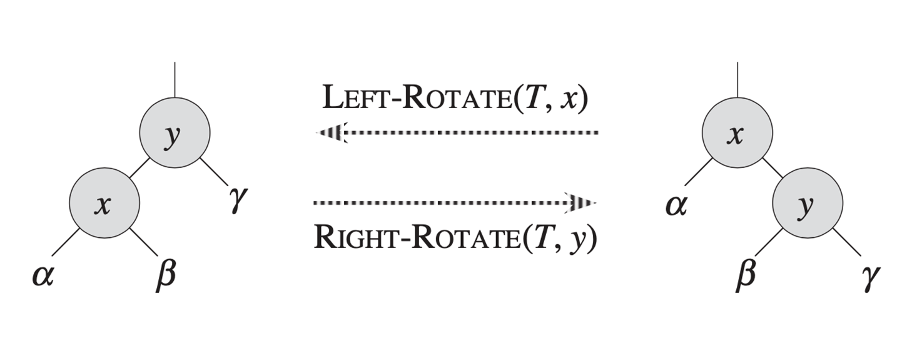
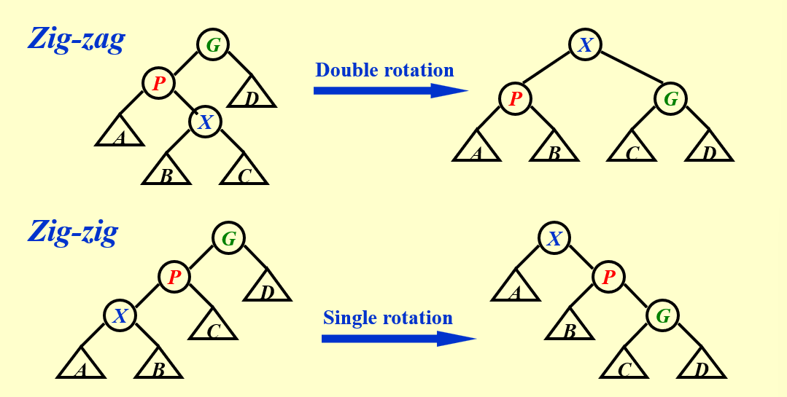
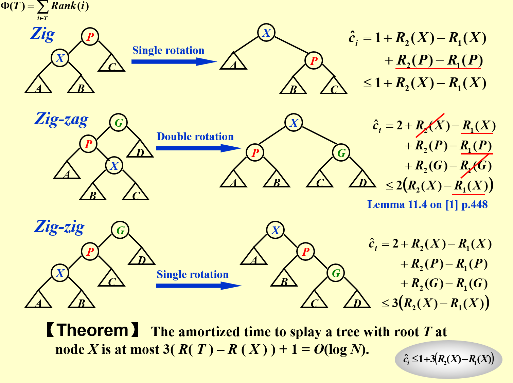
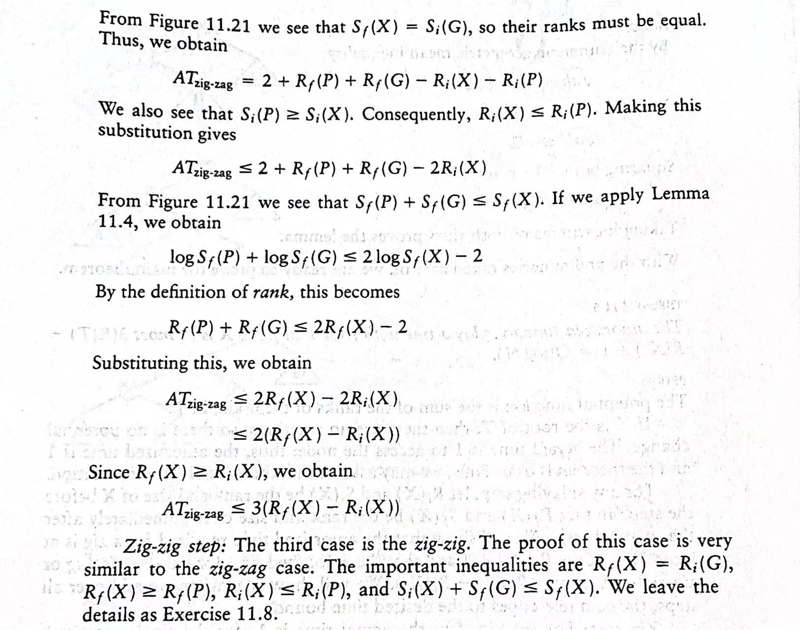

# AVL Trees

## 定义

`AVL Tree`:平衡二叉树就是对于任意一个节点，它的左子树高度与右子树高度的差的绝对值不超过1。

`balance factor(BF)`: 左子树高度减去右子树高度。在一个平衡二叉树中，BF=-1、0或1。

## 实现

为了保持平衡二叉树的性质，或者说为了形成一颗平衡二叉树，需要一些手段来保持定义中的性质

- 左旋操作(left-rotate)
- 右旋操作(right-rotate)

对于上述两种操作，当平衡二叉树被破坏的方式不一样时候使用的情况也不同。

在这边定义两个名词，一个是`trouble maker(TM)`即插入导致失衡的节点，另一个是`trouble finder(TF)`即发现失衡的节点，也就是该节点的BF大于1

- `RR Insertion`: TM位于TF的右节点的右子树中
  - 需要对TF进行`RR Rotation`,其实也就是进行一次左旋操作来恢复平衡
- `LL Insertion`: TM位于TF的左节点的左子树中
  - 需要对TF进行`LL Rotation`,其实也就是进行一次右旋操作来恢复平衡
- `LR Insertion`: TM位于TF的左节点的右子树中
  - 需要对TF进行`LR Rotation`,先对TM的父节点进行一次左旋操作，然后对TF进行一次右旋操作来恢复平衡
- `RL Insertion`: TM位于TF的右节点的左子树中
  - 需要对TF进行`RL Rotation`,先对TM的父节点进行一次右旋操作，然后对TF进行一次左旋操作来恢复平衡

## 数学性质

设n~h~为一棵高度为h的AVL树的最小节点数
设现在有一颗树根节点为A，那么只有以下两种情况，左子树高度为h-2，右子树高度为h-1或者反过来

那么可以得到以下等式： n~h~=n~h-1~+n~h-2~+1(A节点)

根据斐波那契数列可知 n~h~=F~h+3~-1
又斐波那契数列项的大小与其下标在数学上是对数关系，所以可以得到h=O(ln n)

#  Splay Trees

## 定义

`Splay Trees`: 伸展树，一种自调整式的二叉搜索树，其特点是每次访问一个节点时，都将其移动到根节点，并通过旋转操作来保持树的平衡。从而使M个从空树开始的操作最多占用O(MlogN)的时间。

## 实现

### 插入操作

错误的想法：对于每一个访问的元素，一昧的进行单向的旋转操作使其移动到根节点，这样会导致最差情况下将一个链表倒过来倒过去

正确的操作：
首先在这边需要关注三个重要节点：
- 所访问的节点(X)
- 其父节点(P)
- 祖父节点(G)

1. 当X为根节点时，不用任何操作
2. 当P为根节点时，旋转X和P即可
3. 当P不为根节点时，根据X、P、G的位置关系，进行不同的旋转操作
    - `Zig-zag`: G、P、X三个节点不在同一条直线上，进行两次不同方向的旋转，具体旋转方式参考上文提到的LR和RL旋转
    - `Zig-zig`: G、P、X三个节点在同一条直线上，进行两次相同方向的旋转(注意这里先旋转G-P，再旋转P-X)

### 删除操作

1. `Find X`，X成为根节点
2. `Remove X`，剩下左右两棵子树T~L~和T~R~
3. `FindMax(TL)`，找到T~L~中的最大值，将其移动到根节点,此时原左子树的根节点必然只有左子树而没有右子树
4. 让原右子树成为原左子树根节点的右子树

# Amortized Analysis

## 定义

`Amortized Analysis`: 平摊分析，用于分析数据结构各种操作可能发生的时间，并计算出最坏情况下的操作情况并加以平均

不难发现限制性有以下关系:
worst-case bound $\geq$ amortized bound $\geq$ average-case bound

与平均时间不同的是，均摊分析不考虑概率性问题。
平均时间平均的是每个输入的操作，而均摊则是平均了每个操作的消耗

## 种类

- `Aggregate method(聚集法)`:计算n个操作的时间复杂度上限T(n)平摊至每一个操作，则平摊成本为T(n)/n
- `Accounting method(记账法)`:对每一个操作定义一个平摊成本，记c~i~为第i个操作的实际成本，$\hat{c}$~i~为第i个操作的平摊成本，当一个操作的平摊成本大于实际成本时则有盈余，反之则有亏损，盈余记为credit
对一系列的操作，必须有$\sum_{i=1}^n \hat{c}_i\geq\sum_{i=1}^n c_i$
然后把前者的求和除去n即可得到T~amortized~的上限。
- `Potential method(势能法)`:需要定义一个势能函数，将数据结构的状态对应到一个实数上
  - D~0~:数据结构D的初始状态
  - D~i~:数据结构D在第i个操作后状态
定义$\hat{c}_i$ = c~i~ + $\phi$(D~i~) - $\phi$(D~i-1~)
为了满足平摊成本大于等于实际成本，则需要势能之差大于等于0，寻找这个势能函数则变成最困难的问题

## 例子 

1. 见维基百科上的堆栈例子： https://zh.wikipedia.org/zh-cn/%E5%B9%B3%E6%91%8A%E5%88%86%E6%9E%90#%E4%BE%8B%E5%AD%90

2. Splay Trees的分析：

这边有一个引理(可以用基本不等式证明)： 
若a + b $\leq$ c
$\log$a+$\log$b $\leq$ 2*$\log$c-2

该图为书上的证明，i和f分别于ppt中的1和2对应