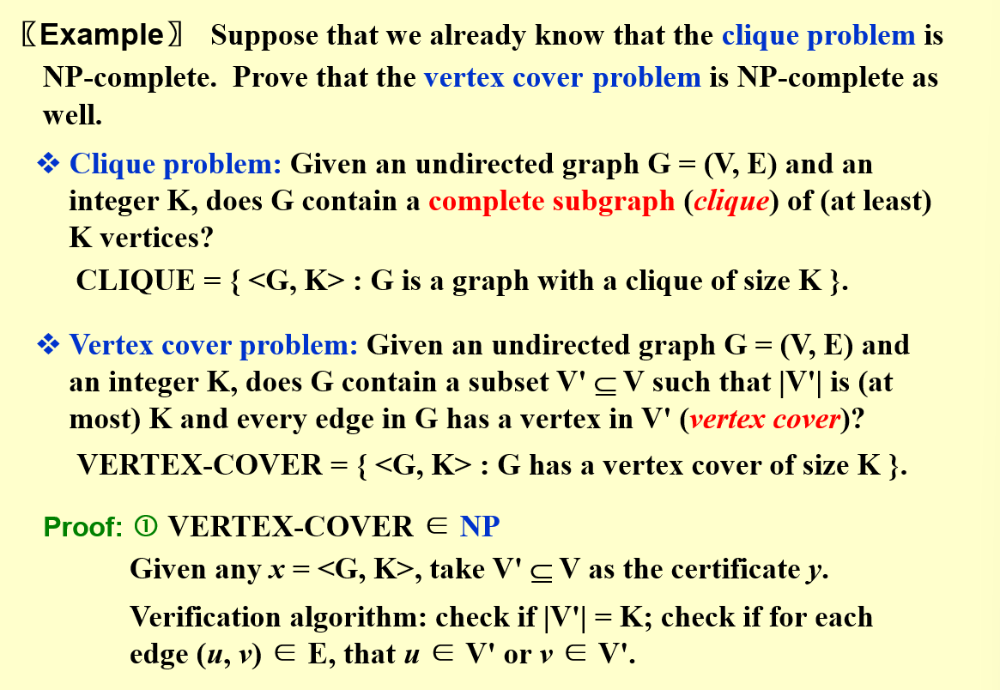

# NP-Completeness

经过证明,以公理为基础推导出来的系统(如数学),是无法在这个系统中得知一切的事物以及证明一切事物的

## 停机问题

是否存在一个程序使得其能够组织所有的无限循环?

答案是否定的

如果存在一个无限循环检测程序,那么它肯定需要能够检测自己是否为无限循环程序

假设现在存在一个程序P,能够判断一个程序是否无限循环

然后我们构造一个程序如上图所示,当传入的程序是无限循环的时候,我们输出并中断该程序,否则就进行无限循环

那么将这个程序本身作为子程序传递给该程序:
若子程序是非无限循环程序,那么将会进入分支2,从而导致程序无限循环下去
若子程序是无限循环程序,那么将会导致进入分支1,从而停机

也就是说存在悖论,即不存在这样的程序P

## 图灵机

图灵机由两个部分组成,分别是无限的记忆(纸带)和一个扫描器
1. 通过改变有限的控制状态
2. 可以擦除在当前位置的符号并写入一个新的符号
3. 扫描器向左,向右或保持不动

图灵机还分为确定性图灵机和非确定性图灵机
- `Deterministic Turning Machine`:在每个时间段执行一个具体的操作,然后根据当前的指令前往下一条指令
- `Nondeterministic Turning Machine`: 自由选择下一条指令,总是选择一条正确的指令使最终结果能够得到正确答案

## P与NP

所谓的`P`问题就是指确定性图灵机能够在多项式时间内解决问题,`NP`问题就是指非确定性图灵机能够在多项式时间内解决的问题

由于非确定性图灵机犹如有一个神一样对其每一个步骤进行选择,从而引导向最终的答案,那么在分析NP问题时,我们便可以担任这个神的职责,也就是假设一个存在一个已知的答案,我们对其进行验证的过程实际上就是非确定性图灵机的运行过程

所以NP问题的等价定义是对于一个问题可以在多项式时间内证明其解的正确性

ps:`NP-hard`就是无法在多项式时间内验证的解的问题

## NP完全

到如今,有关P与NP的关系还没有一个明确的结果,但是倾向于认为P真包含于NP,也就是存在NP问题其非P问题,即对于可以在多项式时间内验证解正确性的问题不一定存在一个多项式解法

但是有一类问题,是NP问题中最难的一类问题,称作NP-Complete问题,即NPC问题

经过证明,所有的NPC问题都归属为同一类问题,也就是说,只要证明了一个NPC问题存在多项式时间解法,那么所有的NPC问题都存在多项式解法,更不用说NP问题了

大致的做法就是进行多项式的归约,如下图所示

第一个NP完全问题:

一个大致可能的关系如下:

## 多项式规约

对于多项式规约的技巧,这边给出几个例子

补齐原图只需要多项式时间,就可以把Hamilton问题转化成Traveling salesman问题

-------------------------------------

得到原图的补图也只需要多项式时间

## 标准语言框架

这部分看ppt进行大致了解即可,在计算理论会进行更深的学习

## co-NP

