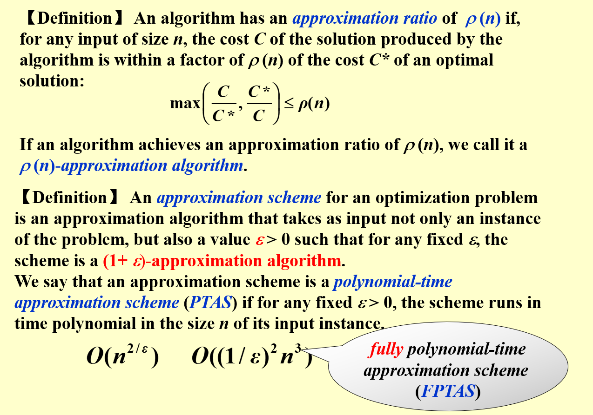

# 近似算法(Approximation algorithm)

是用来发现接近最优解的多项式时间复杂度算法

## 近似率(Approximation rate)

## 近似装货问题

解法一: 只看当前箱子和下一个箱子

解法二和三:找到第一个能装下该物品的箱子或者是能装下的空间最小的箱子

上面的解法都属于`On-line`算法,不能够改变每一步做出的选择,所谓在线算法就是每读一个输入就做出一个选择,而`Off-line`算法则是将数据全部读取后再进行处理

解法四:离线算法

##  背包问题

这个问题实际上在之前的动态规划问题中有所涉及,所以不再过多赘述

### 小数版本

### 0-1版本

动态规划求解:

与之前提到的有所不同,这里动态规划是以价值作为第二个维度,所以当pmax很大的时候,会导致复杂度指数型增长

但是可以用下面的方法来处理

## K中心问题

通过上图可以知道,假设我们知道了这个r的值,那么要验证这个r只需要以2r作为半径,对每个点当作中心进行扫描一圈,就可以判断在k个中心的情况下r能否把所有的点都包含进去

当k轮后,还有点没被包含,则说明r太小了
当小于k轮后,点就已经被包含完了,则说明r太大了

### 二叉搜索

### 最远点

每次都取离中心最远的点,取k次,这样一来所得到的答案C集合就是一个近似的中心集合解

## 总结

