# Local Search

- Local: 确定邻域,局部最优解指的是在邻域的最优解
- Search: 从一个合适的解开始,在邻域内搜索一个更好的解,当在邻域内无法再改进这个解时,就达到了局部最优解

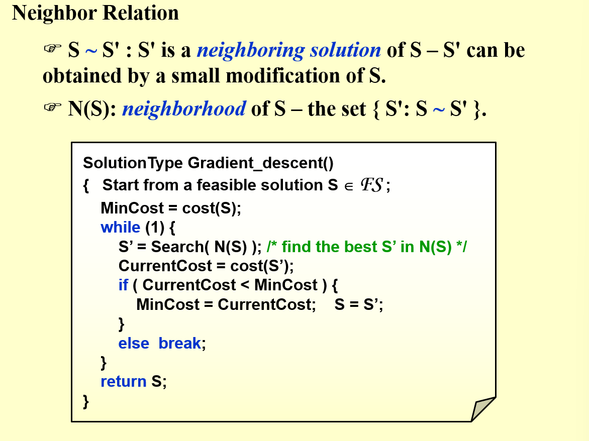

## 顶点覆盖问题

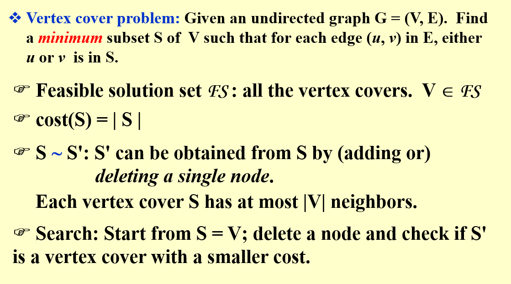

不难发现,该问题的局部最优解不一定是全局最优解

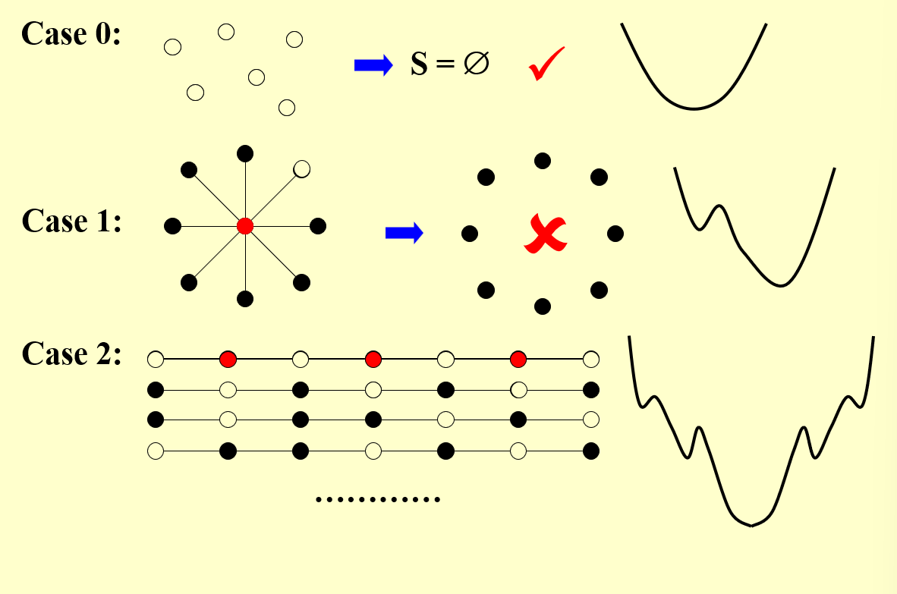

所以尝试改进算法

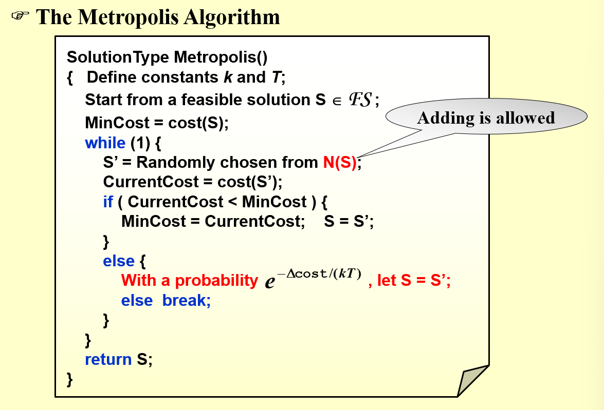

通过这样的改进可以让局部最优解有跳出该点(局部最优解的领域)的可能性,从而达到全局最优解

要实现这一点需要控制`T`,通过让T逐渐由大到小,最终落入我们可以接受的一个最值内

## Hopfield Neural Networks(霍普菲尔德神经网络)

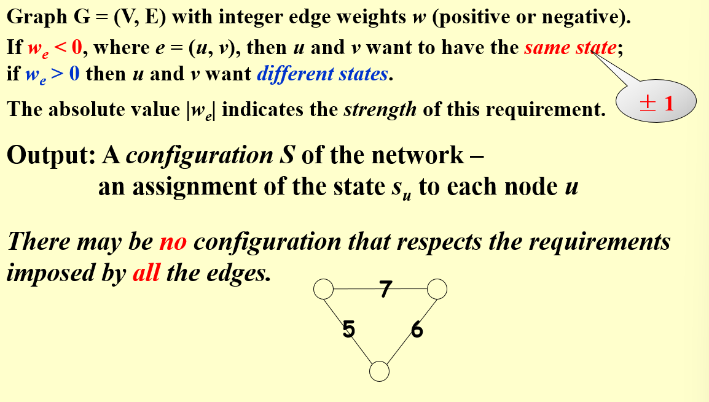

我们规定点的状态有两种,即正负一,当边的权值为正数的时候,两点的状态必须不一样;边的权值为负数的时候,两点的状态必须一样,也就是说两点的值乘上边的值恒为负

但是有可能出现上图显示的图,无法实现一个满足所有边的要求的配置

所以我们就引入一些新的概念

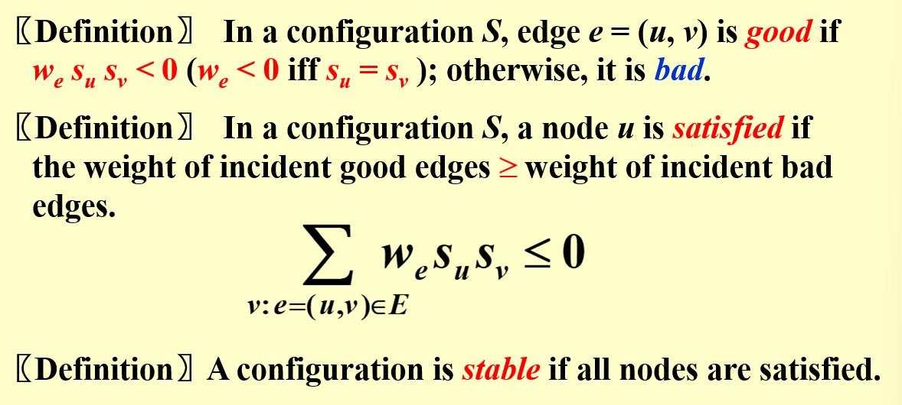

我们规定一条边如果是好的,则两点的值乘上边的值为负,否则就为坏边

对于一个配置S,一个顶点是满足条件的当且仅当与它相邻的好边权值大于坏边权值

当所有点都是可满足的则该配置称为稳定配置

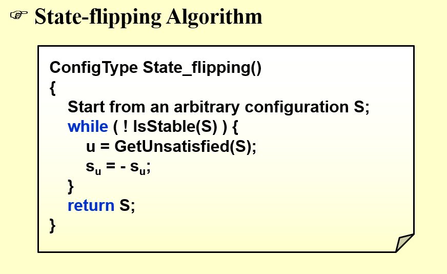

那么问题来了,这样的算法能够确保终止吗,也就是说能够避免死循环吗?

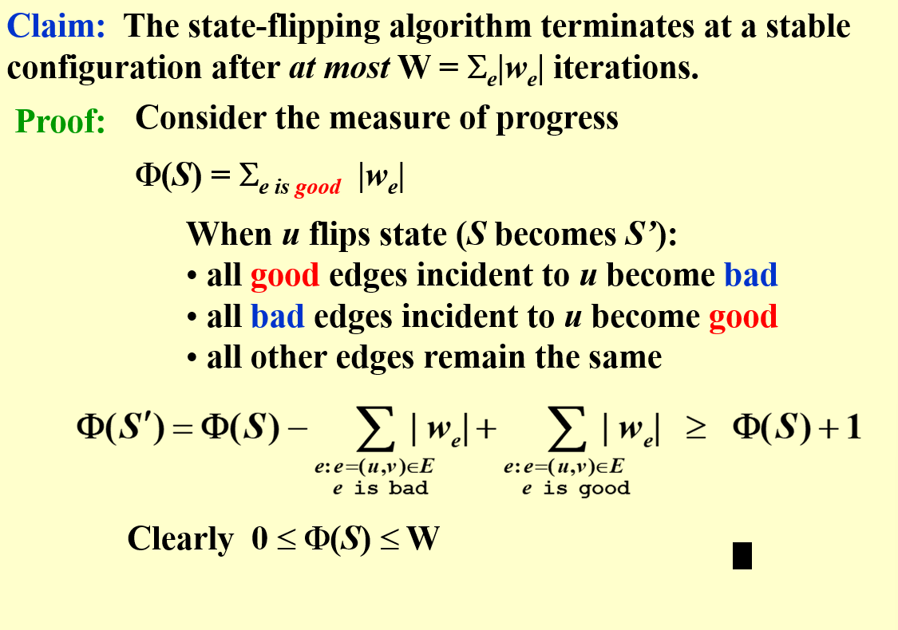

注意到好边坏边都是对于一条边的两个点而言的,所以我们要看总体的好边,而不能单看一个点的好边

那么翻转后的好边权重之和 = 与这个点无关的好边权重之和 + 翻转后的这个点相邻好边之和

那么我们知道对于一个点的翻转,我们必然是要让其好边值大于坏边的,所以好边值必然增加

所以每一次反转都必然导致整体的好边权值至少增加1

而整体好边的最大值就是全部边的绝对值之和

也就是说最多反转图示的W次

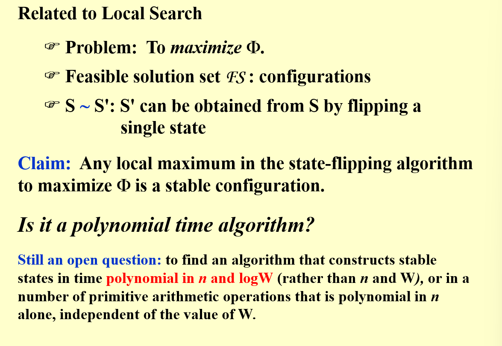

## The Maximum Cut Problem(最大切割问题)

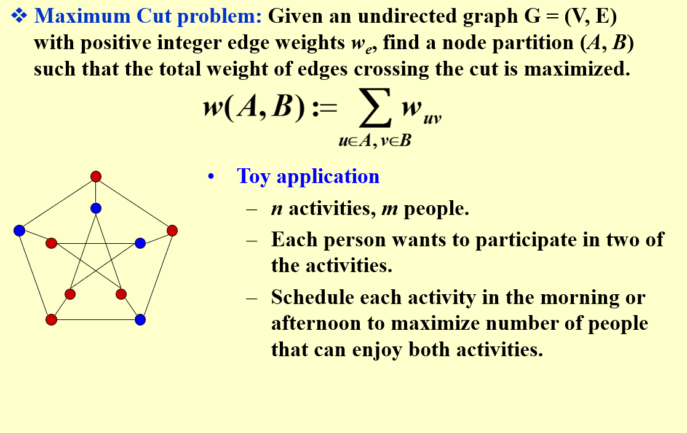

实际上这个问题就是特殊情况的神经网络问题,可以把A,B集合看作两种状态,要让跨越两个集合的边权值之和最大实际上就是让我们刚刚定义的好边值最大

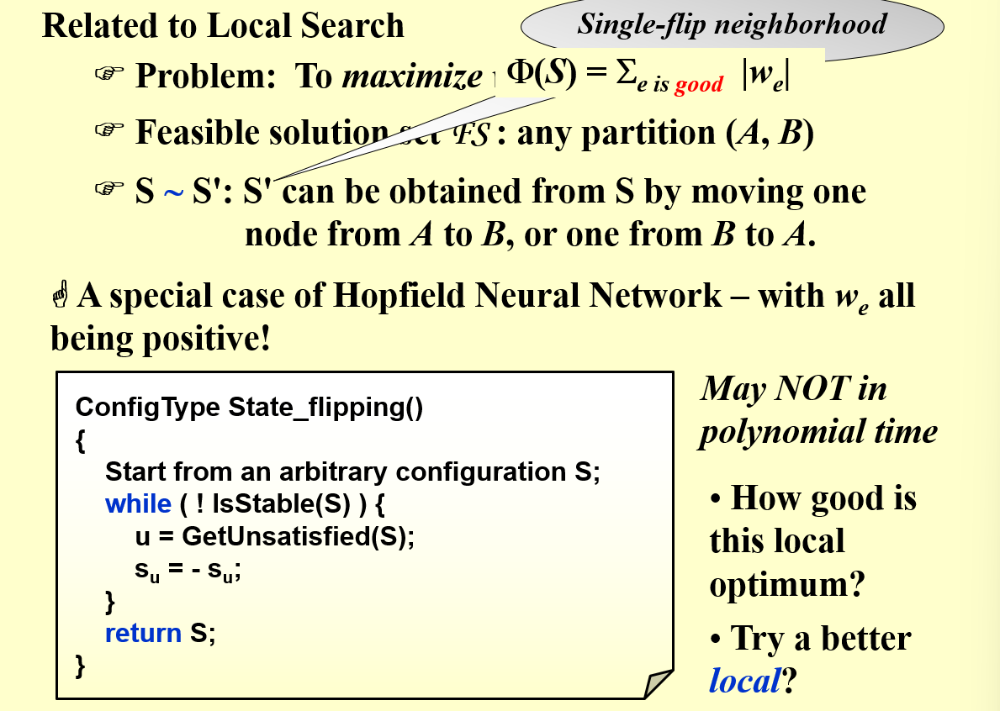

可以粗浅证明出来用local search算法的近似比为2

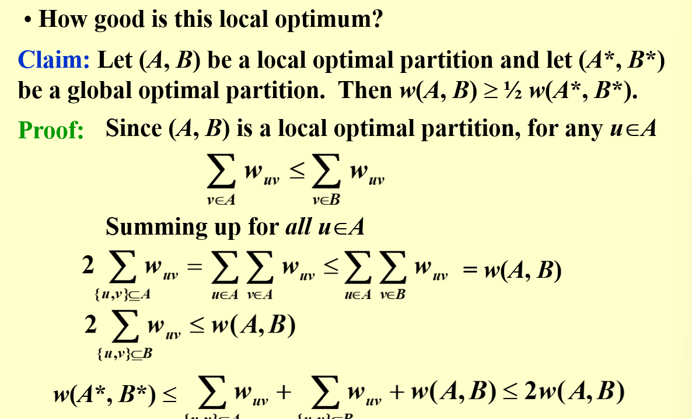

当然我们可以对这个算法进行优化,大致的想法就是当每一次翻转对整体的优化程度小于一定程度的时候我们就直接返回,不再进行优化

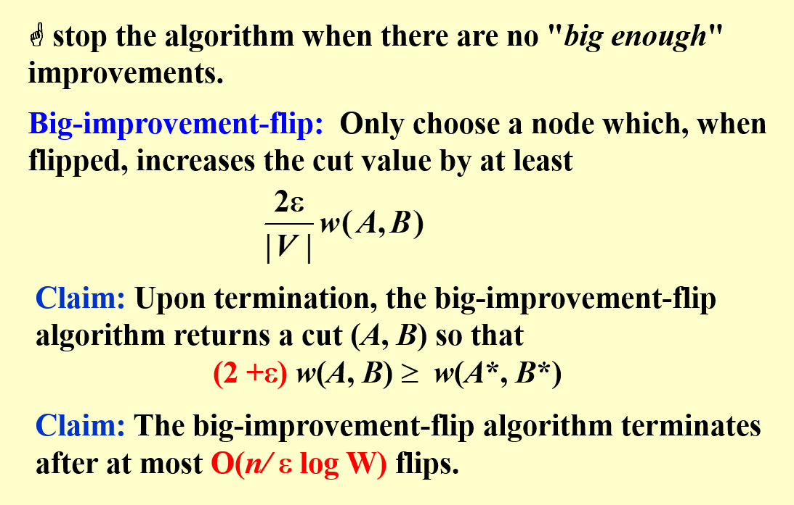

甚至可以考虑一次多翻转几个点

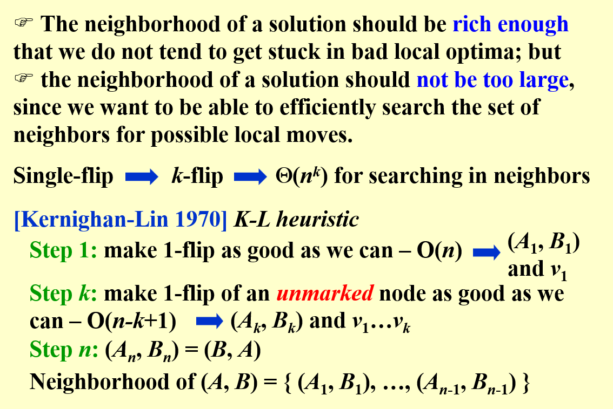