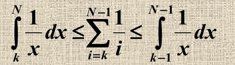

# 随机算法(Randomized Algorithm)

在之前所学的算法中,算法的时间复杂度取决于输入数据的随机性,而在随机算法中,将是算法行为变为随机的

有两种类型的随机算法
- 效率总是高效的,并且保证答案的正确性的概率性很高(但不是百分之百)
- 答案总是正确的,在通常的情况下保持较高水平

## 招募问题

对于N个受面试者,只要当前受面试者的质量高于前面所招募的,则将前面所招募的给开除,并选择招募该员工

### off-line

不考虑使用随机算法的方法:

这样一来当受面试者的质量按照递增的顺序给出,cost将会变得很大

假设受试者的顺序是随机的

之所以第i个人被招募的期望是1/i(概率也为1/i)是因为:对于第i个人,只需要考虑包括他在内的i个人中,最优秀的那个在i这个位置即可,这个概率为1/i

对1/i求和,根据泰勒公式可以知道为对数展开

这样一来的方法应该大致如下:

其中对序列的随机化可以用下面的方法:

也就是通过随机化权值再进行排序

### on-line

在线的该问题略微有点不同,因为我们不能一口气得到所有的人从而进行随机排序
于是考虑设定k,对于前k个人,我们在其中找到质量最高的作为标准但不招募这个人,对于k个后的人,只要有一个人的质量高于这个标准,则选择招募这个人;若没有任何一个人的质量高于这个标准,则选择最后一个人进行招募

写成伪代码大致如下:

第i个人刚好是最好的员工且被招募的概率如下:

第i个要被招募的概率分为两个部分,一是质量最好的在i这个位置,第二是k+1~i-1不能有被招募的(否则算法直接break结束了)

可以通过积分图像得到下面的不等式

最后我们可以取k/N * ln(N/K)作为这个概率的函数,进行求导则能得到对于每个N的k的值使该概率取得最大

## 随机化快速排序

----------------------------------------

找到中心分裂点的概率如图所示为二分之一
所以找到一个符合该条件的点的寻找次数的期望为2,也就是对于N个元素,从期望的角度来分析需要2N的时间寻找这样的一个点

这样一来快速排序的递归树每一层最多有四分之三N个元素

容易得到S关于N的不等式,前半部分表示分割前的数量一定大于等于分割后的,后半部分表示当前的数量一定小于上一层递归树的元素数量

同时又要满足总的问题规模保持不变,所以最多有如图所示个子问题

所以递归树的每一层时间复杂度的期望为O(N)

最多又有对数级个N层的递归树,所以为O(logN)

根据时间复杂度的性质,最终的时间复杂度为二者相乘也就是O(NlogN)