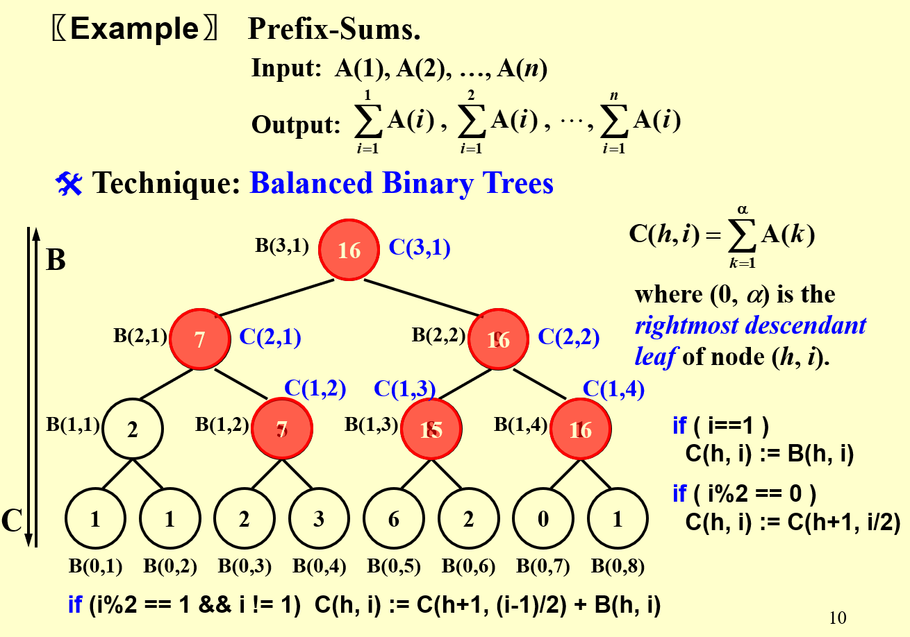
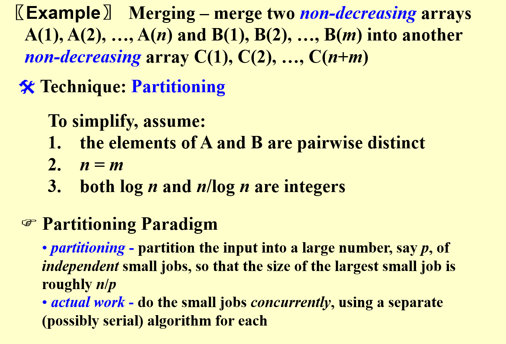
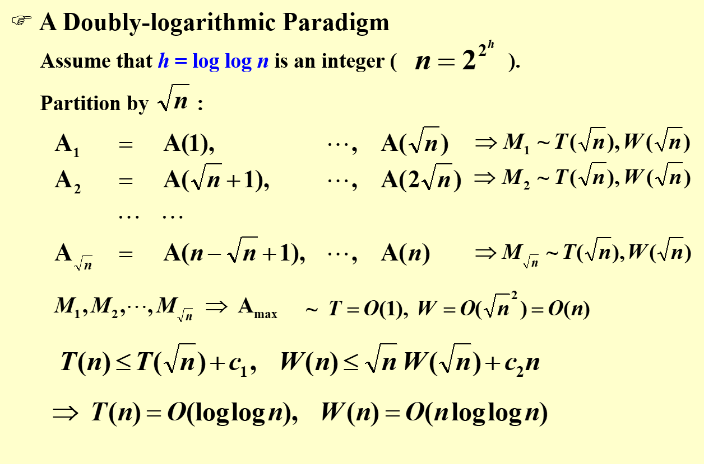

# 并行算法

有两种模型用于描述并行算法
PRAM(Parallel Random Access Machine)和WD(Work-Depth)
前者用于描述并行计算的结构,后者用于评估性能

## PRAM

计算核心对同一个内存进行访问,大体的过程如下

为了解决不同核心对同一个地址的内存进行访问,当访问到同一个地址处的内存时有下述三种解决方法:
- `Exclusive-Read Exclusive-Write`(EREW):既不能同时读也不能同时写
- `Concurrent-Read Exclusive-Write`(CREW):可以同时读但是不能同时写
- `Concurrent-Read Concurrent-Write`(CRCW):既可以同时读也可以同时写
对于最后一种方法还有不同的规则来对写进行约束:
  -  `Arbitrary rule`:任意一个核心写
  -  `Priority rule`:规定核心优先级,写入优先级最高的
  -  `Common rule`:若所有核心的值都一样,则写入

### 加法问题

伪代码如下:
(pardo表示并行做)

由于二叉树的高度为logn,所以并行需要logn次的操作时间,加上第一次的输入和最后一次的输出,所以结果为T(n) = logn+2

## WD

不难发现如果用PRAM来分析的话,需要对每个核心干什么事情进行安排,不易于分析效率,所以用WD模型来分析效率
将核心的安排交给编译器来实现

用来评估表现情况可以由以下几个参数来决定

W(n)表示在n个输入的情况下,所有核心加起来要干的事情的次数,可以视作功耗
T(n)表示在n个输入的情况下,所有核心用并行算法解决这件事情所需的最坏时间,可以视作速度

我们要设计的算法应该是要功耗小且速度快的

可以得到一个结论:
一个并行算法用WD模型分析的时候,对于给定的P(n)个核心,其时间复杂度为O(W(n)/P(n)+T(n))
可以直观进行理解,当核心多的时候,再多也没有用,因为存在空闲的核心
当核心数量少的时候,所有的核心都没能空闲,此时的时间复杂度不能达到有空闲时的时间复杂度
所以对于上述的两项,取最大的一方作为时间复杂度

### 加法问题

T(n) = logn + 2
W(n) = n + n/2 + n/22 + n/23+ ... +n/2k (2k = n)
     = 2n

### 前缀和问题

其中自下而上先算出B中的值
然后再自上而下算出C中的值

伪代码如下:

### 合并问题

利用了分割技术,把一个大事件分割成多个小事件,然后让这些小事件并行处理

可以把上述的合并问题转化为排序问题:

由于A,B序列都是有序的,所以通过找到A中元素在B中应该排第几,找到B中元素在A中应该排第几,综合A本身和B本身该元素的位置,就可以直接计算出在最后合并的C中的位置

看下面这个例子可以更直观的理解 

通过分割进行优化

先通过第一次的选择进行比对后,可以看图中划分出的绿色区域,最多划分出p个区域
在每个区域中进行并行计算
由于这时候每个区域中的元素为n/logn,所以带入二分查找的算法中, plogn = n
这样一来就可以在保证速度的情况下降低功耗

### 最大值查找问题

这个算法实际上就是用n2个核心同时计算两个元素之间的大小后,把结果放入另一个数组中
最终那个最大的元素对应的位置应该仍未0,可以看出来虽然速度很快,但是功耗太大

####　分割
继续采取分割的思想进行速度和功耗之间的调整

以根号n为分割大小进行分割:

前面根号n个A进行并行计算的时候,采用功耗比较小的算法,比如顺序查找,这样一来这些并行最终的结果如图右侧所示

最后对这根号n个最大值采取那个功耗大的算法,经过整理后的复杂度就如图中所示

以h为分割大小进行分割:

对A1~Ah还是用功耗较小的算法,然后对这n/h个最大值再用根号n进行分割,从而可以通用上面的公式,最终得到图中结果

#### 随机取样

随机从整体样本中取n7/8个元素,然后进行分块后再用高功耗的算法进行计算,
然后再对这些分块后得到的每块的最大值再进行分块计算直到最后一步

对于剩下那部分的样本,如果存在比我们计算出来的值还大的,那么我们可以重新划分,把其这个元素扔到我们划分的那个块中,重新再计算一遍