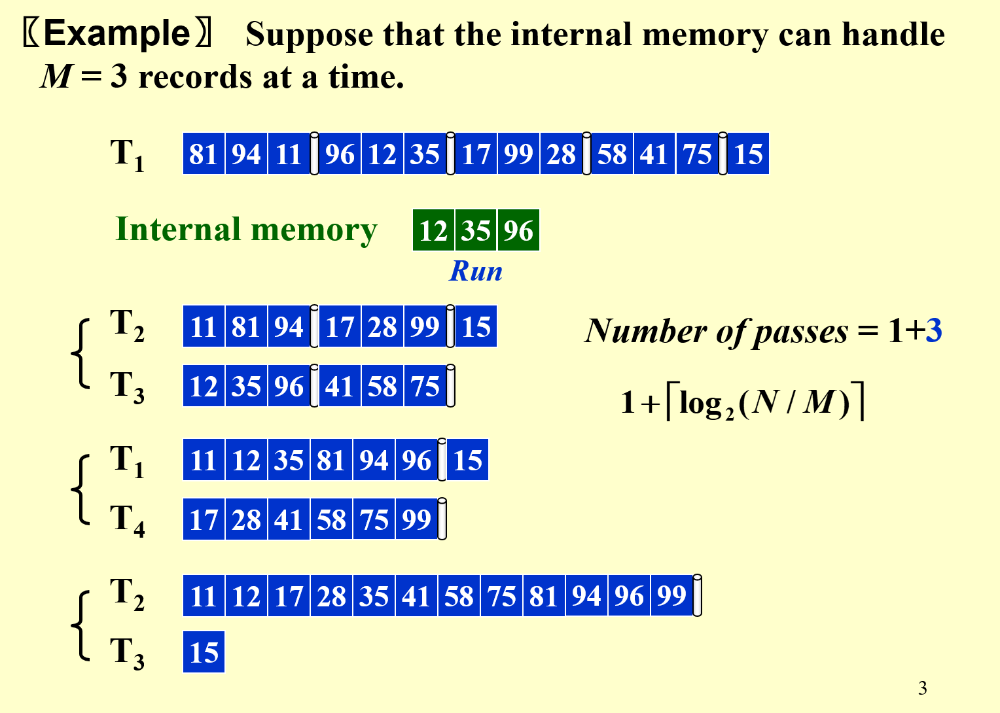
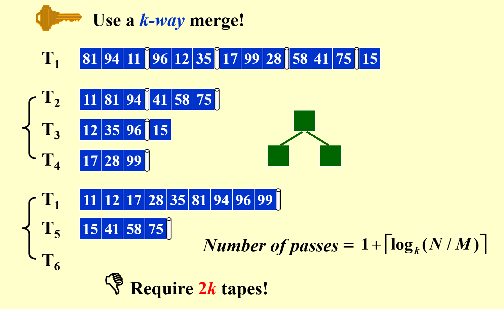
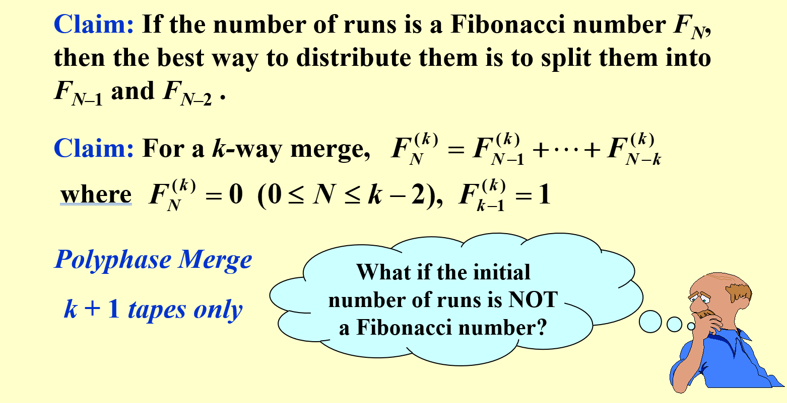
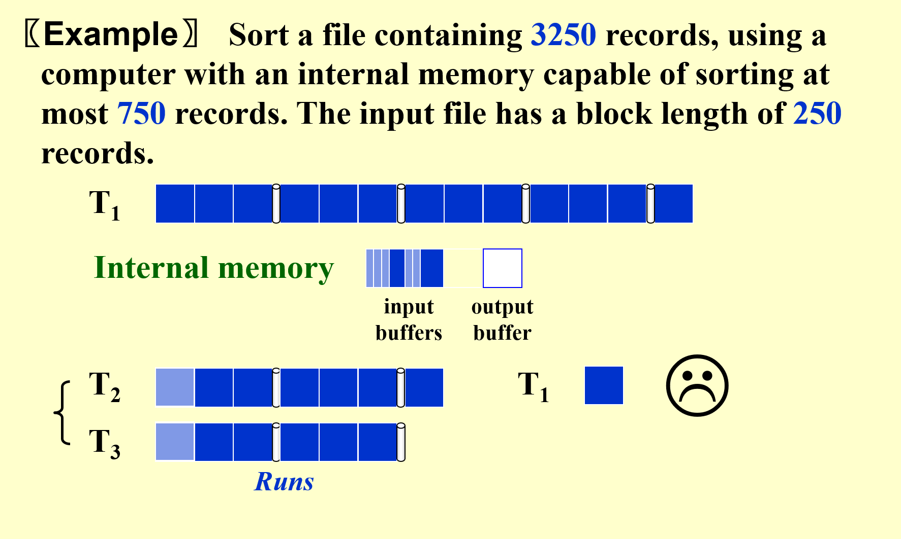
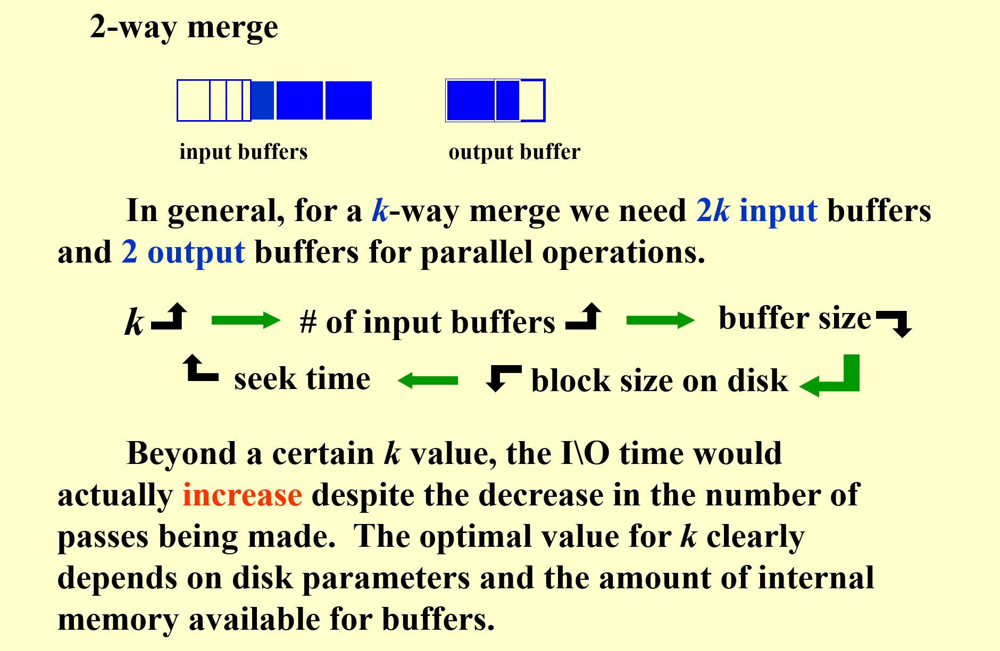
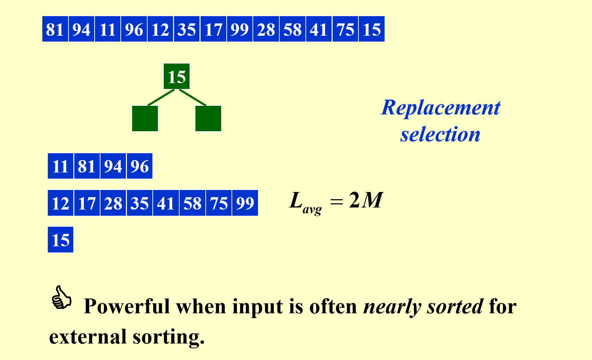
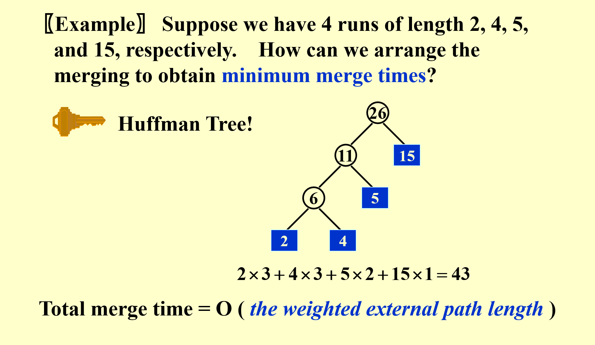

# 外部排序(External sorting)

在内存有限的情况下不可以之间简单的使用快速排序来实现数据的整理
而需要采用另外的工具:Mergesort

通过把数据先从磁带中划分成内存可以存放的大小,然后依次排序,再写回,经过几轮后就可以实现全部数据的排序

第一个pass是先从T1中依次取run(这里的run指的是内存最多能存放的数据),然后排序后放到T2,下一个run放到T3以此类推

有了基本的概念后我们再来讨论这个算法的瓶颈在哪
- pass的个数(寻道时间)
- 读取和写入block的时间(一般来说取数据并不是只取一个而是取一个block)
- 内存中排序的时间
- 从输入buffer中合并数据到输出buffer所需要的时间

## 减少pass

即使用多个磁带,但并非一个好方法

------------------------------------
为了减少使用磁带的数量,我们就必须重复使用磁带

这个方法是每次划分按照斐波那契数的特征进行划分

假设T1:34run
1. T2:21run T3:13run
2. T1:13run T2:8run
3. T3:8run T1:5run
4. T2:5run T3:3run
5. T1:3run T2:2run
6. T2:2run T1:1run
7. T3:1run T2:1run
8. T1:1run 合并完成

相比于均分,这个方法来划分可以减少pass的个数,避免了不必要的复制过程,并且只需要k+1个磁带即可

当起始数不为斐波那契数的时候,可以加入空格,把空格当作一个数据,从而把起始数变为斐波那契数

## buffer的并行操作

可以看到当k增大时,输入的buffer数量也会增加,在内存不变的情况下buffer的大小就要降低,意味着磁盘上的block大小也要降低,从而每次读数据的量减少,寻道时间就增加了

这意味着k虽然能够减小pass,但是每个pass的时间是会增大的,因此k不是越大越好

## 创建更长的run

利用替换选择算法,每当一个数据读入的时候,就与当前run中的最后一个数据进行比较,若不能放在这个run中,则保留到下一个run中去

## 减少合并时间

利用哈夫曼树来实现,看上述ppt很容易能理解这样做的目的是什么