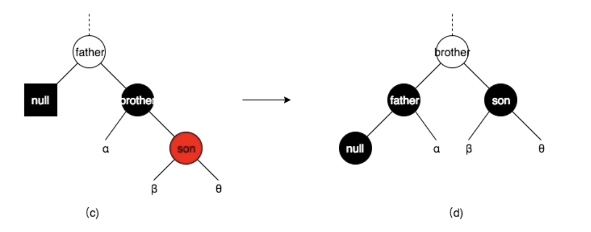
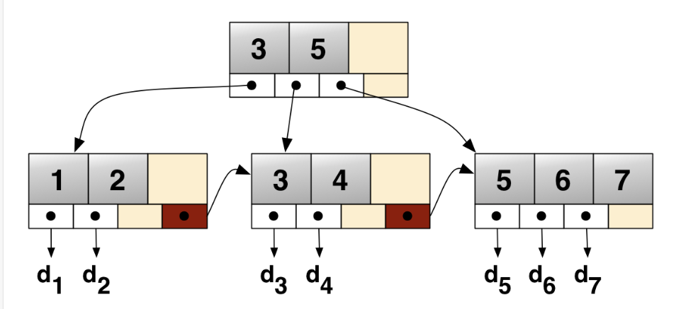

# 红黑树

## 性质

红黑树是每个节点都带有颜色属性的二叉查找树，颜色为红色或黑色，还有以下的性质

1. 节点是红色或黑色
2. 根节点是黑色
3. 所有叶子都是黑色（叶子是NIL节点）
4. 每个红色节点必须有两个黑色的子结点，或者说每个叶子到根的所有路径上不能有两个连续的红色节点
5. 任意节点到其每个叶子的所有简单路径包含相同数目的黑色节点

## 插入

需要将插入的节点设为红色，若为黑色则会导致根节点到叶子路径上多出一个黑色节点，难以调整，所以设为红色节点会比较好处理，但是设为红色节点可能就会出现两个红色节点相邻的情况，所以要利用`颜色调换(color flip)`和`旋转(rotate)`来调整树结构。

需要注意的是插入时必然作为新叶子节点(NIL)的父节点插入，我们记插入的节点为**N**，N的父节点为**B**,N的祖父节点为**G**，N的叔父节点为**U**

### 情形1：插入的节点是根节点

在这种情况下只需要把该节点重绘为黑色满足性质2，二每个路径上的黑节点数都加1，符合性质5

### 情形2：插入的节点的父节点为黑色

这种情况下性质4没有失效，性质5也没有受到威胁：
取代了P的NIL叶子节点，然后自己作为一个红色节点，所以N的NIL叶子节点到其任意一祖先节点路径上的黑色节点数量与插入前P的NIL叶子节点的一致

### 情形3：插入的节点的父节点为红色

产生矛盾的主要原因是颜色冲突，为了解决颜色冲突才会进一步引发黑色数量的冲突

需要注意的是在这种情况下G一定存在，否则父节点为根节点必须为黑色

### 3.1 叔父节点U为红色

在这种情况下只需要把P和U都改为黑色，G改为红色，然后递归地把G当作N来判断属于哪一种情形

为什么需要递归判断？ 
可以发现档G为根节点的时候则与性质2矛盾，若G的父节点
为红，则与性质4产生矛盾，所以需要递归判断

现在假设G的改变直接符合了整个树的性质，基于这点，来分析这个操作的合理性：由于N为红色节点，所以其NIL节点相当于P原来的NIL节点，而经过P和U的原来路径需要经过G一个黑色节点，变色后，P和U都变为黑色，所以黑色点的数量保持不变(当由于G为根节点而变为黑色时，每条路径都多一个黑色所以相对不变)

### 3.2 叔父节点U为黑色或不存在(为NIL)

#### 3.2.1 GPN呈现zig-zig

这种情况需要在P与G之间做一次旋转，并把G变为红色(先前必须是黑色，否则违反性质4)，P变为黑色

这样一来原先经过G的路线现在经过P，原先经过P和U的路线仍保持黑色节点数量不变

#### 3.2.2 GPN呈现zig-zag

先在P与N之间做一次旋转，接着把P当作插入的N，进行zig-zig情形的处理

### 总结(共五种情形)

ps:旋转的次数为O(1)

## 删除

首先对于删除我们需要考虑删除的点是否有两个孩子，但是学习过二叉树我们知道，可以将该问题转换为只有一个孩子的点的删除(若这个点有两个孩子，则取左子树最大或右子树最小的值赋值到该点，由于不改变颜色，所以不影响树的构成)

综上我们只需考虑有一个孩子的节点的删除

### 删除的点(N)是红色

经过简单的逻辑推理可以知道该点的子结点必须为NIL否则会出现一边的黑色节点比另一边的更多

直接把该点删除，不会对红黑树产生任何影响

### 删除的点(N)是黑色

这下可以分为两种情况(默认有一边的节点为NIL)，下面说的子结点为另一边的

且必须注意到不能存在黑色的子结点，不然会出现其中一边的黑色节点数多于另一侧的情况

#### 子结点为红色

用该子节点的值覆盖删除点的值并把子结点置为NIL即可

#### 子结点不存在(另一侧也为NIL)————最复杂的情况

接下来我们把该删去的点直接置为NIL(黑色)记作N,现在需要分析N的父节点与兄弟节点

1. 兄弟节点为黑色，且兄弟节点有一个直线关系的红色子结点

(当有直系关系的节点的时候可以不用考虑另一侧的)

这个时候由于经过N的路径相对于删除前少了一个黑色节点

所以我们可以通过：
- 父节点与兄弟节点的旋转
- 兄弟节点和父节点颜色互换
- 红色子结点变为黑色

来保证经过N的路径黑色节点数不变

2. 兄弟节点为黑色，且兄弟节点有一个折线关系的红色子结点

通过旋转后变为情况1进行执行即可

3. 兄弟节点为黑色，且没有红色子结点

- 父节点为红色：兄弟节点和父节点颜色互换即可
- 父节点为黑色：兄弟节点变为红色，并把父节点当作新的N来递归处理(此时经过父节点的路线不经过父节点的路线少了一个黑色节点，因为我们相当于是把兄弟节点路径上的黑色节点数减少了1)

4. 兄弟节点为红色

此时父节点必为黑色

我们通过兄弟节点和父节点的旋转，便可以把兄弟节点变为黑色节点从而回到前三种情况

### 总结

ps:旋转的次数为O(1)

# B树与B+树

## B树

### m阶B树的性质

1. 对于每个节点来说，最多m个分支，m-1个元素；对于根节点来说最少2个分支1个元素，对于其他节点来说最少m/2(向上取整)个分支，m-1(向上取整)-1个元素 
2. 有k个子结点的非叶子节点拥有k-1个键，且升序排列，满足`k[i]<k[i+1]`
3. 所有的叶节点都在同一层

如下图

### 查找

查找B树中的元素与二叉树查找差不多，从根节点开始从上到下递归遍历树，对每个节点进行比较，若当前节点的关键字大于查找关键字，则转到左子树，若小于，则转到右子树，直到找到或查找失败。

### 插入

我们假设每次插入都是插入到叶节点，对于B树的插入，会出现**上溢出**的情况

- 如果叶子节点空间足够，也就是该节点的关键字数小于m个(插入后小于等于m个)那么直接插入在叶子节点中的某处即可
- 如果叶子节点空间不够，也就是该节点的关键字数已经有m个，那么我们要进行**分裂**操作

所谓的分裂操作如下就是将一半数量的关键字元素分裂到新的其相邻右节点中，中间关键字元素上移到父节点中

- 从该节点的原有元素和新的元素中选出第m/2(向上取整)的元素记作M
- 小于M的元素放入左边节点，大于M的元素放入右边节点
- M插入父节点中，进行递归判断此时父节点是否需要分裂

### 删除

删除的操作对比插入的操作会更难一点，会出现**下溢出**情况

和二叉树删除一样，删除有左右孩子节点的元素总可以通过替换左子树最大和右子树最小的方式转换为删除叶节点的元素

- 如果删除叶节点的元素后该节点中元素数量不小于m/2(向上取整)-1则直接删除并按序排列其中元素即可
- 如果小于则需要进行下面三步的判断
  1. 看其相邻兄弟节点是否丰满(即扣除一个元素后不发生下溢出)
  2. 如果丰满则向父节点借一个元素后将兄弟节点对应的元素变为父节点(左兄弟最大元素或者有兄弟最小元素)
  3. 如果不丰满，则需要进行合并操作，先把父亲节点中对应的元素下移到该节点中，然后把该节点和兄弟节点合并，递归判断父节点是否溢出(进行合并的时候要注意是否有子树，有的话也要把子树合并过去如左兄弟的右子树或右兄弟的左子树)

需要注意的是如果进行合并操作的时候父节点变为空节点(即暂时没有了元素)也要把他空在那里递归进行向上操作，才能够最终把整棵树的高度降下来

## B+树

B+树其实和B树很相似，比较明显的不同是其叶子节点存在一条链表将其相互串起来，一般来说除了root指针以外，还有一个head指针指向叶子节点链表

可以认为真正的关键字(key)只存在于叶子节点中，其他节点中的索引都不是关键字，只是索引的索引

节点中的元素存的是其右子树最小值的索引值(或者左子树的最大值)记作I

### 查找

除了B树的查找方式以外还有一条通过叶节点链表的顺序查找道路

### 插入

考虑的要点和B树一样，需要考虑**上溢出**处理方法也差不多，只不过需要注意的是父节点元素的替换不是中间元素值，而是I

### 删除

需要考虑**下溢出**,方法和B树差不多

# 一些可以辅助学习的网站

在线生成可视化B树：
https://www.cs.usfca.edu/~galles/visualization/BTree.html