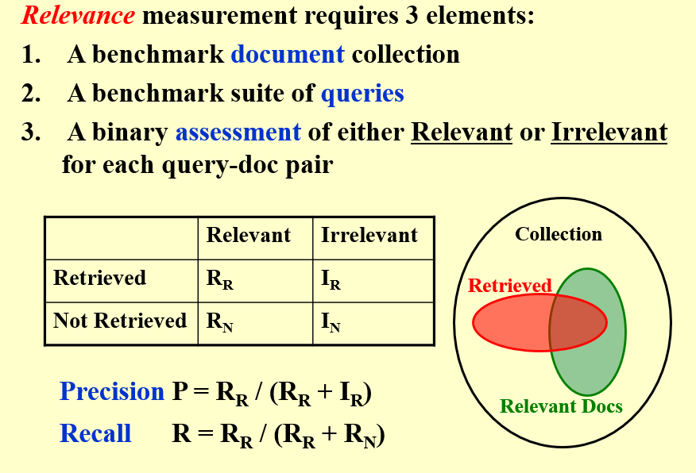

# 倒排索引(inverted file index)

## 定义 

- index： 给出一个词定位出该词在文档中的位置
- inverted file:包含一系列指针，这些指针对应的词指向其出现的文章

该数据结构由一个Term Dictionary和一个Posting List组成。

- Term Dictionary: 包含所有词，以及指向其posting list的指针。
- Posting List: 包含指向文档的指针，以及词频。

## 用处

该数据结构一般用来进行搜索引擎的搜索操作

## 访问Term

可以用各种搜索树实现，如B数、B+树等

也可以通过哈希实现

## 分区

如果说数据很多的话，需要储存在不同的电脑(服务器)当中，则需要有一个规则来进行分区

- 基于文档：把文档按序编号后分区
- 基于关键字(如首字母)：把关键字按首字母分区

## 关于检索

若是数据检索,更考验的是响应时间和索引空间

若是信息检索,则更考虑相关性

# 搜索引擎的工作(就英语而言)

1. word stemming:对搜索词进行处理，一个词的不同形式实际上要对应到一个相同的词

2. stop words：一些经常出现的词，如"the"，"and"，"of"等，是没有区分意义的，所以可以直接过滤掉

