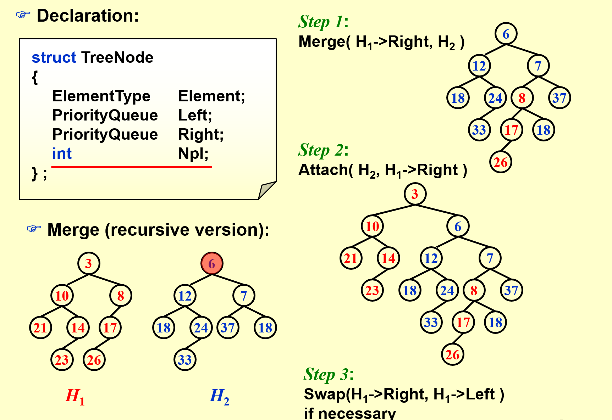
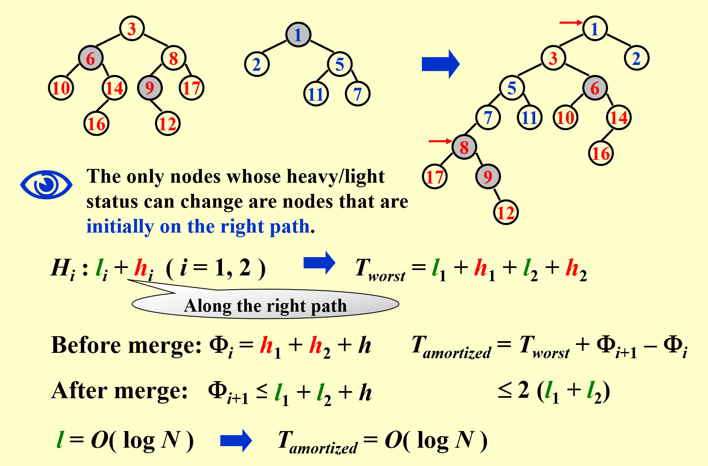

# 左式堆(Leftist Heap)和斜堆(Skew Heap)

## 引入

在数据结构基础中我们所学习的堆实际上是通过数组实现的，这样实现的堆在合并的时候将会遇到许多问题，消耗的时间复杂度较大，这样一来我们必须要设计一种基于指针的堆，让这种堆的合并的时间复杂度会相对较小

## 左式堆

- `null path length(NPL)`:对于任何节点X，npl是该节点到其没有两个孩子的节点的最短道路，定义空节点的npl为-1

npl(x) = min{ npl(c)+1 | c是x的任意一个孩子 }

- `leftist heap`:其性质是对于每一个节点X在该堆中，其左孩子的npl>=其右孩子的npl

从而可以得出一个引理：一个左式堆若右道路有r个节点，则整个堆至少有2^r-1个节点

### 合并

插入可以当作只有一个元素的堆的合并

对于两个堆，合并的过程如下：

1. 从两个堆中调堆顶元素更小的那个作为根节点，如果其没有右孩子，直接插入
2. 如果有右孩子与其右孩子进行比较，递归进行第一步
3. 最后要修改右道路上的各节点的npl，如果违反了左式堆的性质，则左右子树互换即可

合并操作可以通过递归简单实现，用迭代的方式也可以实现，直接对两个堆的右道路上的孩子依次比较即可知道插入顺序

合并操作的时间复杂度由上文提到的引理可以知道是log(N),因为只沿着右道路插入，而右道路的长度为log(N)数量级

### 删除

先删去根节点，然后将其左右子树当作两个堆进行合并操作

## 斜堆

左式堆实际上是斜堆的一种特殊情况，也就是说斜堆的限制更为宽松，是左式堆的的一种简单版本

其没有npl的概念

### 合并

斜堆在合并的时候也是把元素较小的作为根节点，然后插入右子树后进行一次左右翻转，可以明显知道的是，该方法无法保证左式堆的性质

所以其在合并上不能实现真正意义上的log(N)的复杂度，但是在摊还意义上确实是能够实现的，接下来将给出证明

### 摊还成本

- `heavy nodes`：当一个节点的右子树节点个数大于等于左子树时其就为`heavy node`
- `light nodes`：当一个节点的右子树节点个数小于左子树时其就为`light node`

观察上图可以发现以下性质：
- 只有两个堆的右道路上的节点其轻重性质才会改变
- 当一个重节点经过反转后必然变为轻节点，甚至更轻；但是一个轻节点经过反转后却不一定变为重节点，因为其左子树会插入一颗树，就可能导致左子树实际上相加比右子树重

至于为什么l1+l2为logn，可以这样直观理解，当右道路长了，右道路中的轻节点就少了；右道路短了，就变成了一个近似的左式堆，所以说l1+l2实际上是有限制的，在摊还意义上最终结论能够达到logn的复杂度
 