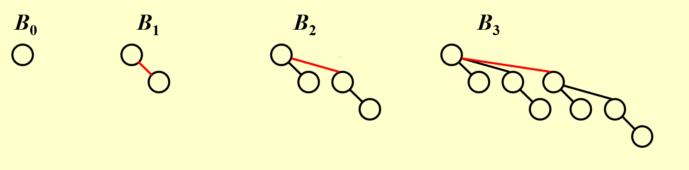
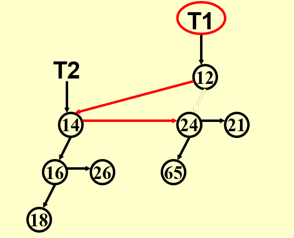

# 二项队列(Binomial Queue)

## 定义

一个二项队列不是一个堆树，而是一群堆排序的树的集合，我们称其为森林，其中每一棵树我们称为binomial tree。

1. 一颗二项树的高度若为0，则其是一个单节点树
2. 对于B~k~,其高度为k，其高度的形成是通过合并另外一颗B~k-1~的树形成的

不难看出来其符合二项式系数的值

从而进一步我们可以把二项队列看作一个二进制数，其中B~n~是否存在表示二进制第n位是否存在

## 操作

### Findmin

在上文提到可以把其看作一个二进制数，则根节点个数实际上就是logN,由于我们需要遍历这个二项队列的根节点来找到最小值，所以时间复杂度为O(logN)

但是我们可以通过提前记住的方法将其变为O(1),但是就是每次操作都需要检查是否需要重新记住

### 合并

看作两个二进制数相加，位数为logN，则合并的时间复杂度为O(logN)

### 插入(特殊的合并)

对于插入，我们可以通过均摊分析得到其均摊时间复杂度为O(1)

最差时间复杂度为O(N)

平均时间复杂度为O(1)

均摊分析证明如下：

首先我们直观感受，若一个二进制数相加，其第一位为0，我们只需计算一位即可，若第一位为1，则需向前进位，进一步检查是否需要再进位，依次类推，只要出现第一个0则可以停止进位，也就是cost到此为止

我们令c~i~为第i次插入的cost，势能为第i次插入后树的个数

假设i次插入前第一个0前面的位数为k个，后面1的个数为x

则插入前的势能为x+k，插入后的势能为x+1

c~i~ = k+1

c~i~ + (势能i-势能i-1) = 2

从而证明了均摊时间复杂度为常数级

### 删除min

首先进行findmin操作，把这个节点所在的树从原二项队列拉出来，然后将这个根删除后形成了一个新的二项队列，再与原二项队列进行合并即可

## 具体实现

用first child next sibling的处理方式将其改变为一个二叉树形式的堆

