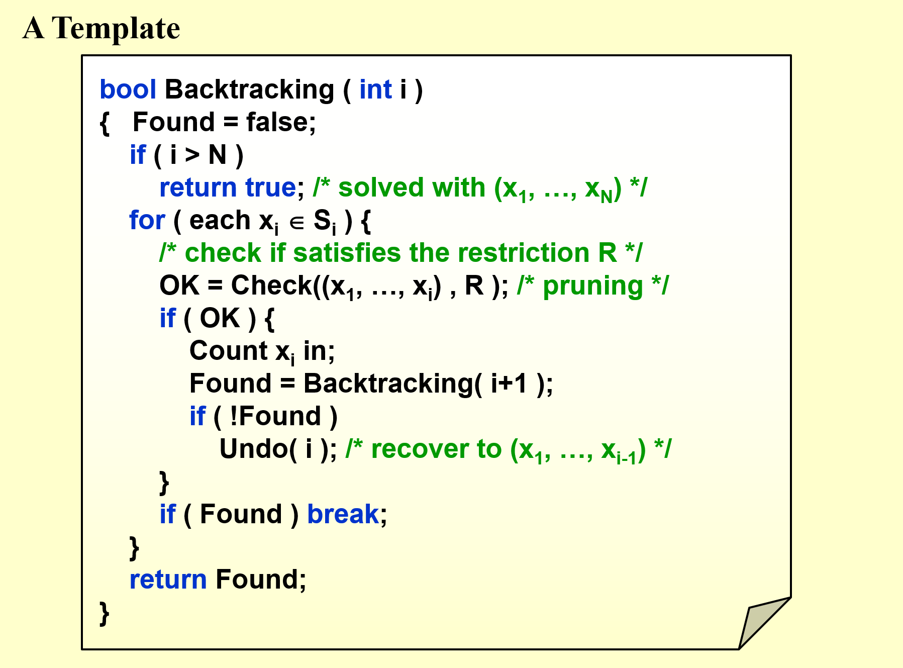
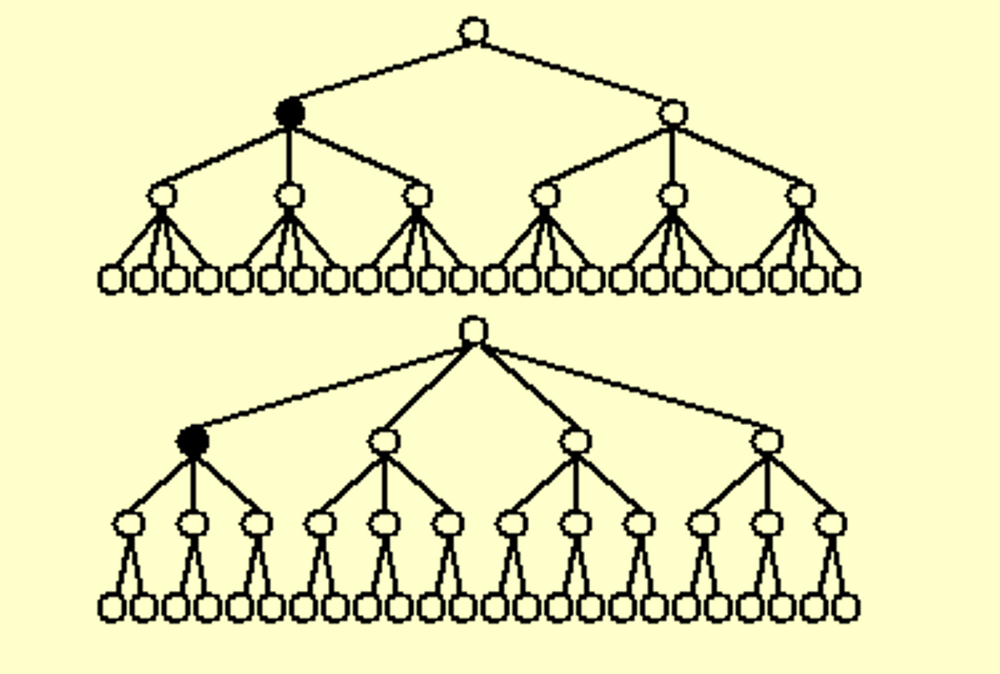
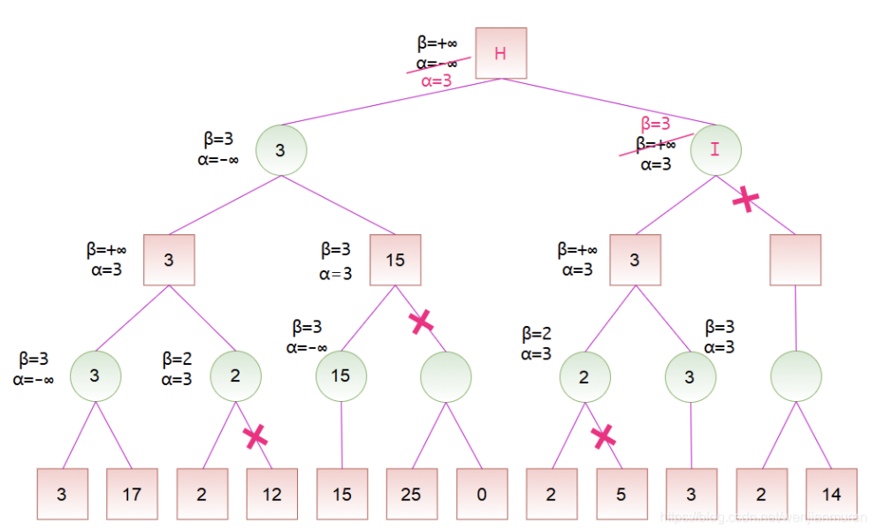

# 回溯算法(Backtracking)

## 定义
回溯算法（backtracking algorithm）是一种通过穷举来解决问题的方法，它的核心思想是从一个初始状态出发，暴力搜索所有可能的解决方案，当遇到正确的解则将其记录，直到找到解或者尝试了所有可能的选择都无法找到解为止。

由于回溯算法的想法较为简单，就是通过判断当前的选择能否满足限制条件，如果能则将其视作一种选择，如果不能则回退到上一步，递归进行，这种思维常常是结合不同的实际问题进行分析和设计。

## 模板

可以套用下面的模板进行单条道路的选择

## 子集的选择

不难看出来选择子集较少的在前面可以有效的进行排除

# Minimax 策略

Minimax 算法又叫极小化极大算法，是一种找出失败的最大可能性中的最小值的算法。

在局面确定的双人对弈里，常进行对抗搜索，构建一棵每个节点都为一个确定状态的搜索树。奇数层为己方先手，偶数层为对方先手。搜索树上每个叶子节点都会被赋予一个估值，估值越大代表我方赢面越大。我方追求更大的赢面，而对方会设法降低我方的赢面，体现在搜索树上就是，奇数层节点（我方节点）总是会选择赢面最大的子节点状态(即max)，而偶数层（对方节点）总是会选择我方赢面最小的的子节点状态(即min)。

## Alpha-Beta 剪枝

Alpha-Beta 剪枝是一种对 Minimax 算法的优化，它通过对搜索树进行剪枝，减少搜索树的大小，提高搜索效率。

实际上很好理解

当max节点中已经通过他的一个子结点找到了一个未确定的max，其他的子结点中若已经得到了一个未确定min值，且该min值小于当前的未确定的max值，则该子结点剩余的子结点可以直接裁剪掉

同理，当min节点中已经通过他的一个子结点找到了一个未确定的min，其他的子结点中若已经得到了一个未确定max值，且该max值大于当前的未确定的min值，则该子结点剩余的子结点可以直接裁剪掉

而且我们规定按照深度优先搜索的方式进行，也就是说左子树会先进行探测