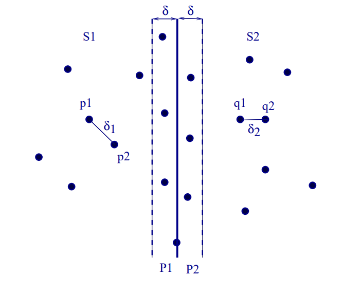
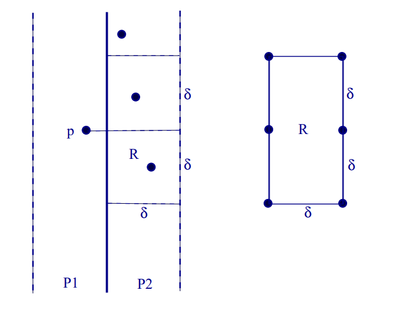
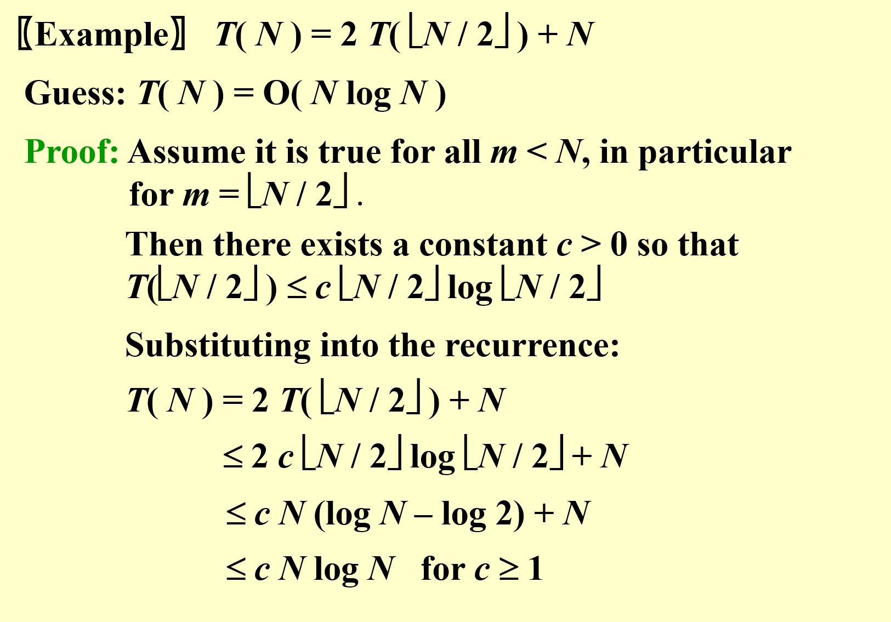
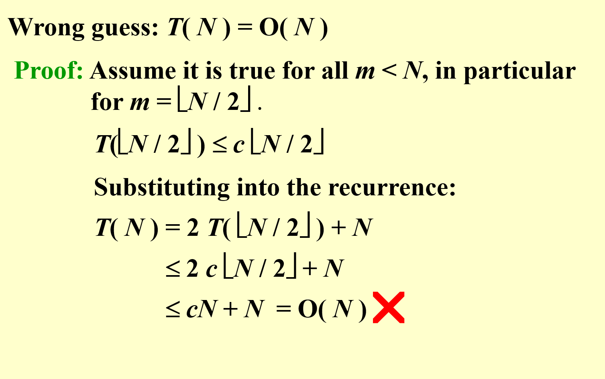
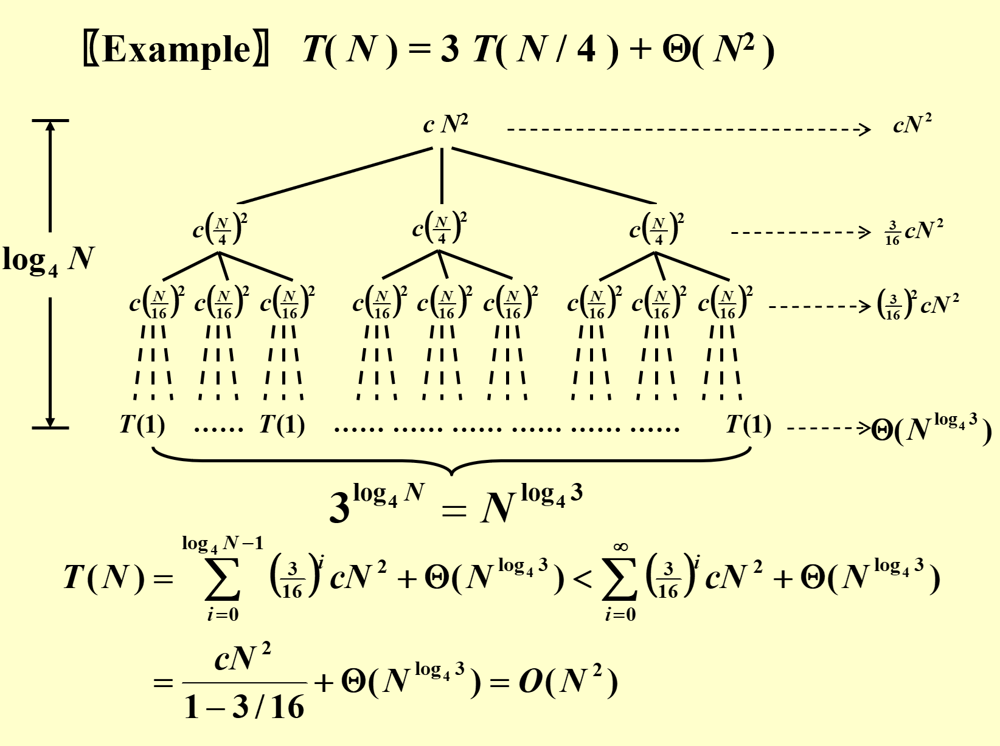
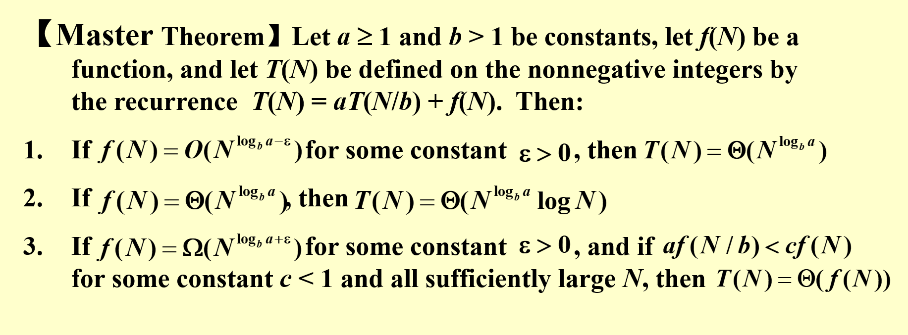
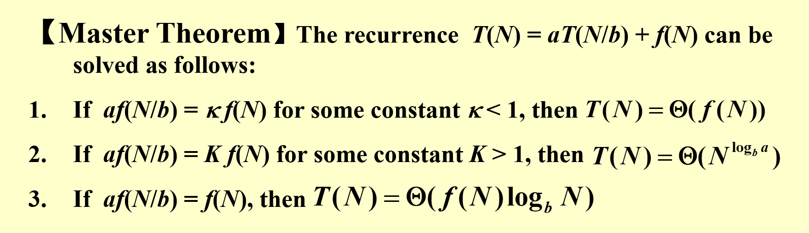
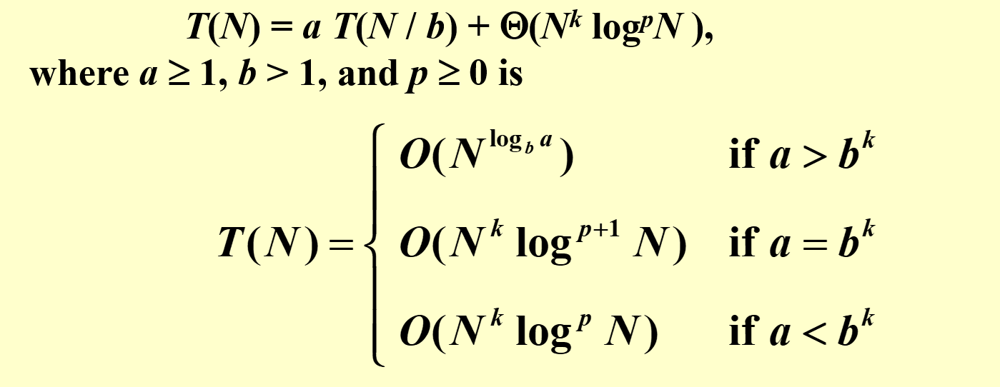

# 分而治之(Divide and Conquer)

递归地进行问题的分解,从而解决整个问题,大致可以分为下面三个步骤
- `Divide`: 将问题分解为一系列子问题
- `Conquer`:递归解决子问题
- `Combine`: 将子问题的解归并到原问题中

大致的递归式子如下：
T(N) = a*T(N/b) + f(N)

## 最近点对(Closest-Points Problem)

考虑有一系列的点在一个平面上,求两点间的最短距离

如果要用分而治之的想法去解决这个问题,那么一个直观的想法就是,先把点按照x坐标排序后,
进行划分,左右各一半的点,然后算出左边的最短距离,再算出右边的最短距离,最后算出跨越中间的最短距离,最后进行合并得到结果

然而这样会产生一个问题,就是跨越中间的距离进行搜索时需要(n/2 * n/2)也就是O(n^2)的时间复杂度,经过分析后可以知道实际的复杂度无法达到(nlogn)

所以需要改进,首先是针对x轴上的改进

以中轴线往两边划出一块区域,这个区域的宽度为子问题得出来的最小值*2,这样就能确保中间需要算的值一定是有效的
超过这个范围的点没必要考虑,彼此之间的距离若跨过中轴线必是大于子问题得到的结果

但是这样还是有可能无效,因为可能n/2的点都挤在这个区域内(比如在y轴上分布)

于是我们需要从y轴上对算法进行改进

延续优化x轴的想法进行区域的划分,在这个矩形中最多有6个点,多一个都会导致先前得到的最小值是错的。这样一来遍历这个区域的最大时间复杂度是n/2 * 6也就是O(N)

## 分析递归方程的时间复杂度

### 替换法(Substitution method)

其实是一种证明方法,在大致猜出这个方程的时间复杂度后,可以假设T(M) = O(g(m)) => T(M) < g(m)

后续只需要证明对于任何N>M , T(N) < g(n) 即可,实际上可以看作一种数学归纳法

正确估计

错误估计

### 递归树法(Recursion-tree method)

作出一颗以N开始为根的递归树,直到叶子节点,从而分析整体的时间复杂度,可以通过下面这个例子进行理解

### 主方法(Master method)

记住公式即可,具体的证明不必过多了解

但是按照这个公式是无法分析当f(n) = nlogn 之类的情况的时候 因为找不到那个最小值 $\varepsilon$ 所以无法用这个形式的主方法实现

第二种形式的主方法,但是有点鸡肋没什么用

第三种是最强大的,第一种不能解决的形式通过这个公式也能得到

