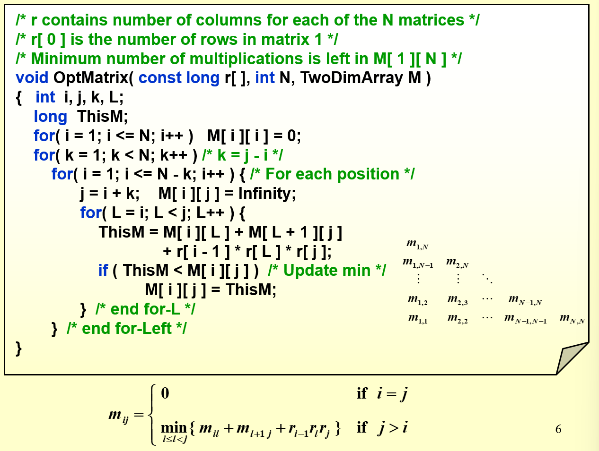
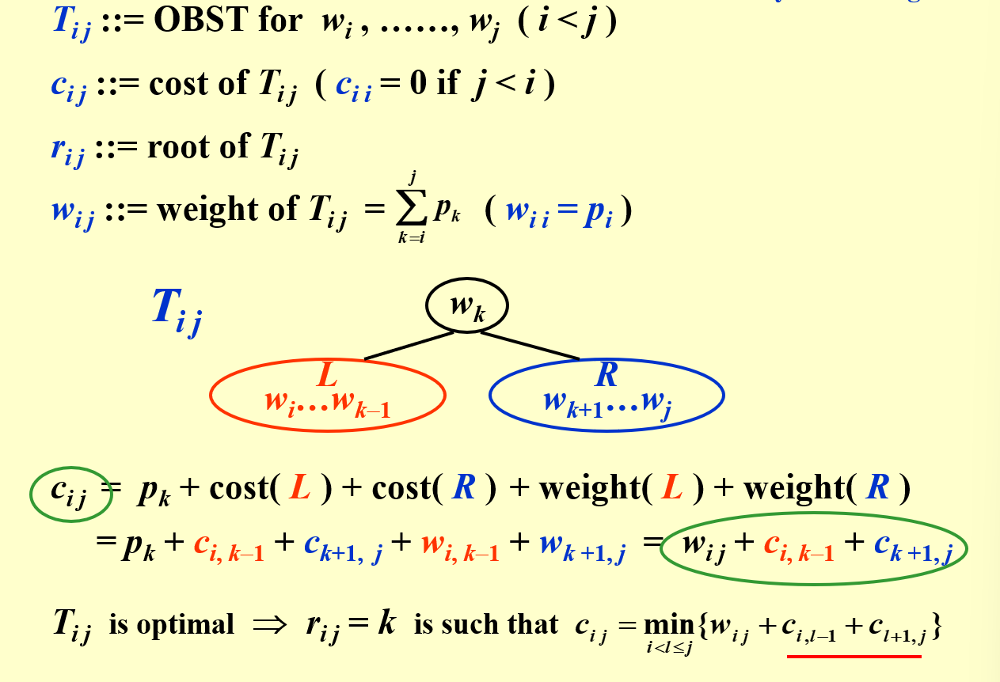
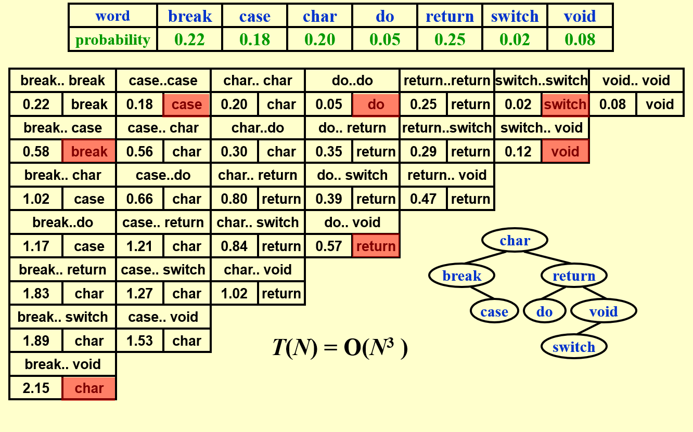
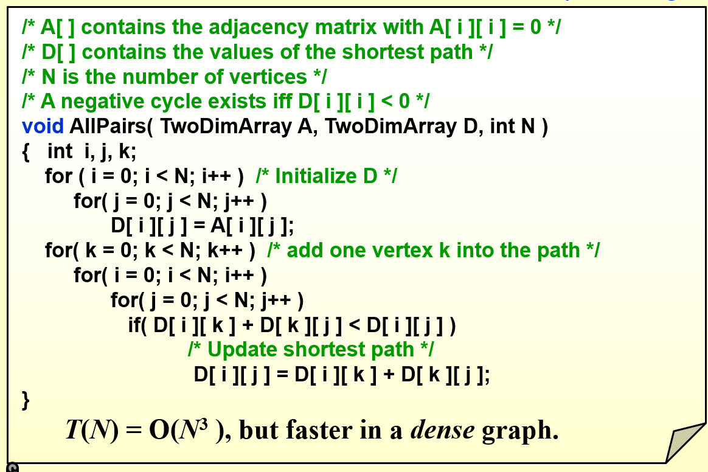

# 动态算法(Dynamic Programming)

仅解决一次相同的子问题,每次解决后把答案存放在表中

重复子问题(Overlapping Subproblems): 子问题之间存在重叠
优化子结构(Optimal Substructure): 问题的最优解包含子问题的最优解


本质上来说,动态规划就是将递归的由顶自下转化成为自底向上,从而避免重复计算相同的子问题,从而达到优化子结构的目的。


若一个问题包含重叠子问题,最优子结构并满足无后效性,则适合用动态规划求解

可以先判断是否能用决策树进行回溯算法的解决,若可以则可以进一步尝试使用动态规划来求解

通常有以下几个步骤:
1. 描述决策
2. 定义状态
3. 建立dp表
4. 推导状态转移方程
5. 确定边界条件


动态规划和回溯过程可以描述为一个决策序列，而状态由所有决策变量构成。它应当包含描述解题进度的所有变量，其包含了足够的信息，能够用来推导出下一个状态。

每个状态都对应一个子问题，我们会定义一个 dp表来存储所有子问题的解，状态的每个独立变量都是表的一个维度。从本质上看，dp表是状态和子问题的解之间的映射。

dp表的索引表示不同的状态,其中的值才是问题的解。


下面通过几个问题来窥探动态规划的特点


# 动态规划问题

## 矩阵乘法问题

求n个矩阵乘积的顺序,使其计算的时间消耗最少



- 决策:矩阵的划分

- 状态:我们定义状态为第i个矩阵到第j个矩阵的分为一组,可以得知dp表应该有两个维度

- dp表: dp[i][j]表示从第i个矩阵乘到第j个矩阵消耗的最少时间

- 状态转移方程:如上图 

- 边界条件: dp[i][i] = 0

## 最优二叉搜索树问题

给定N个词,每个词的查找概率为w,设计一棵二叉搜索树,使得查找词的平均时间消耗最少



首先把词按照词序由小到大排序,这样起始可以转化成为类矩阵乘法的问题

- 决策: 根节点的选择

- 状态: 第i个词到第j个词组合在一起构成一颗树

- dp表: dp[i][j]表示从第i个词到第j个词组合的最小平均查找时间

- 状态转移方程: 如上图

- 边界条件: dp[i][i] = w[i]




## 全对最短路径问题



- 决策:是否把该点加入到路径中

- 状态:第i个点和第j个点之间的距离

- dp表: dp[i][j]表示从第i个点到第j个点的最短距离,这种表示方法意味着i和j之间可以存在多个点,而不是只有ij两个点


- 状态转移方程: 每加入一个点,都进行判断这个点的加入是否会让原先的距离变短,如果会,则更新dp[i][j],需要注意的是由于这边的dp总是保存着两个点之间当前的最短距离所以在加入一个新的点的时候,其到i和j的距离也是最短的,从而可以实现更新


## 0-1背包问题(摘自hello算法)

给定n个物品,第i个物品的重量为w[i-1],价值为v[i-1],背包的容量为cap,求解将哪些物品装入背包,可使价值总和最大

- 决策: 对于第i个物品是否放入背包

- 状态: 前i个物品是否放入,当前背包的剩余容量

- dp表: dp[i][j]表示前i个物品有选择的放入背包后,当前背包的剩余容量为j时的最大价值

- 状态转移方程: dp[i][j] = max(dp[i-1][j], dp[i-1][j-w[i-1]]+v[i-1])

前一项表示不放入第i个物品,后一项表示放入第i个物品,同时更新背包当前容量

- 边界条件: dp[i][0] = 0 , dp[0][j] = 0

源代码如下

```c
/* 0-1 背包：动态规划 */
int knapsackDP(int wgt[], int val[], int cap, int wgtSize) {
    int n = wgtSize;
    // 初始化 dp 表
    int **dp = malloc((n + 1) * sizeof(int *));
    for (int i = 0; i <= n; i++) {
        dp[i] = calloc(cap + 1, sizeof(int));
    }
    // 状态转移
    for (int i = 1; i <= n; i++) {
        for (int c = 1; c <= cap; c++) {
            if (wgt[i - 1] > c) {
                // 若超过背包容量，则不选物品 i
                dp[i][c] = dp[i - 1][c];
            } else {
                // 不选和选物品 i 这两种方案的较大值
                dp[i][c] = myMax(dp[i - 1][c], dp[i - 1][c - wgt[i - 1]] + val[i - 1]);
            }
        }
    }
    int res = dp[n][cap];
    // 释放内存
    for (int i = 0; i <= n; i++) {
        free(dp[i]);
    }
    return res;
}

```

