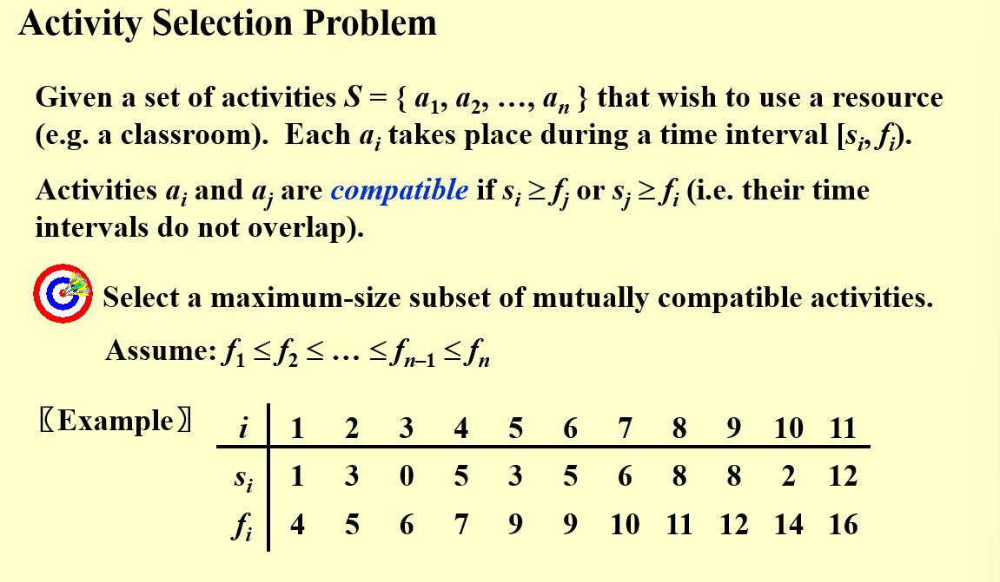
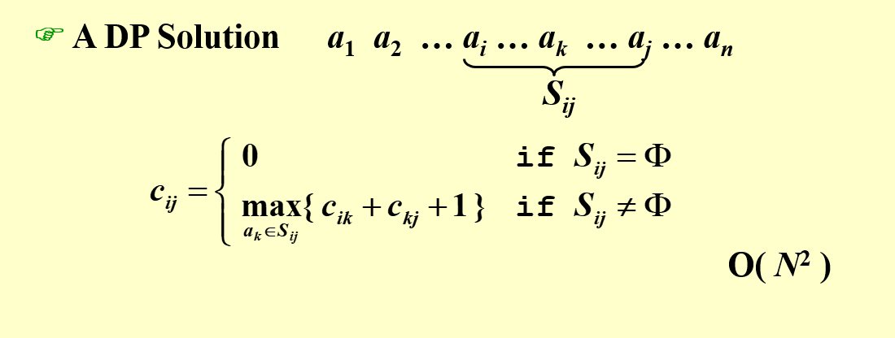
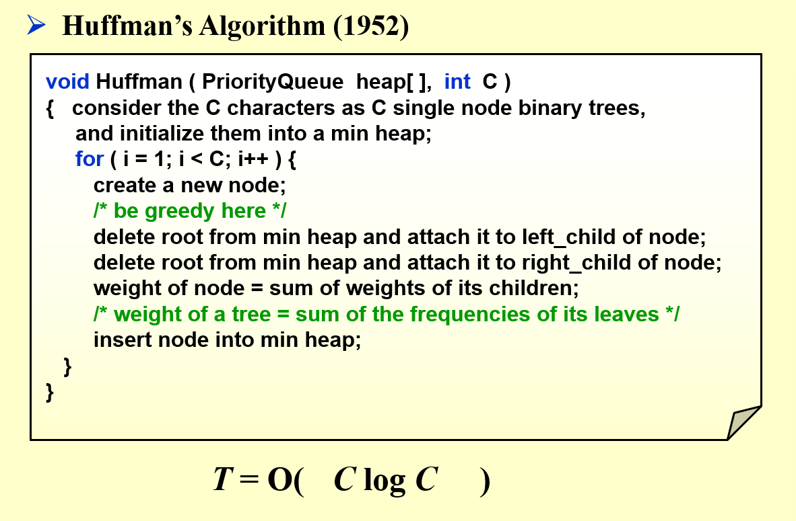
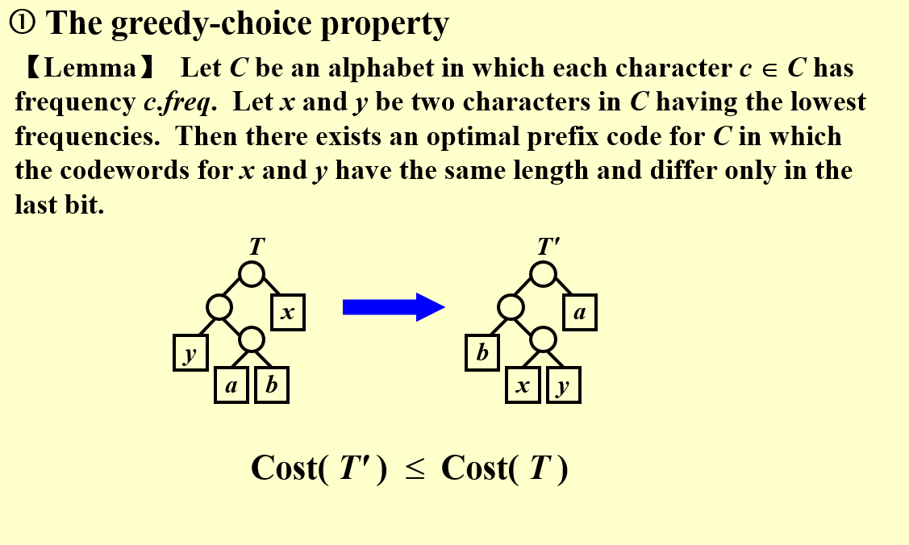
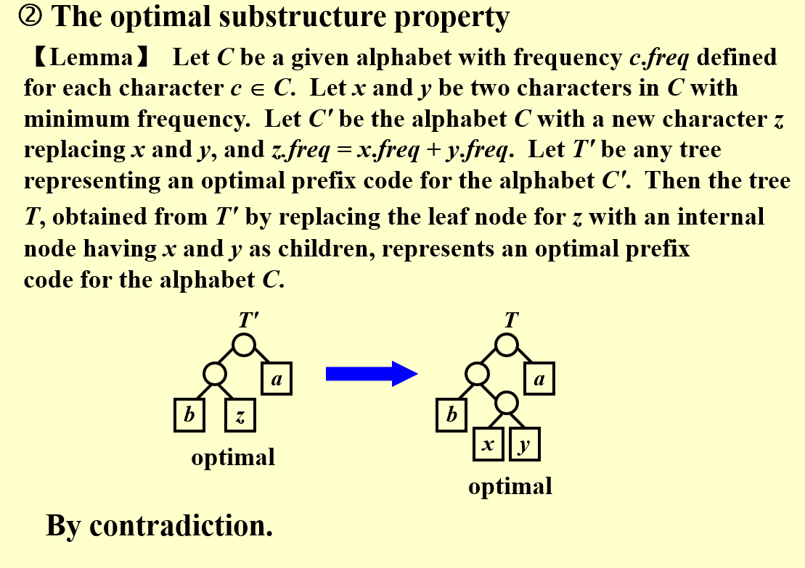

# 贪婪算法(Greedy Algorithms)

最优化问题:
给定一系列限制和一个最优化方程.
满足条件限制的解叫做可行解
一个最优化方程的可行解叫做最优解

贪婪方法:
在每一个阶段做出最好的决定,在一个阶段中做出的决定在下一个阶段那是不会被改变的,所以每一个决定都应该确保可行性

需要注意的是:
- 贪婪算法可行当且仅当本地优化相当于全局优化
- 贪婪算法不保证最优解,但是一个好的贪婪算法可以在值上近似得到最优,所以当找最优解消耗的时间很多的时候不妨可以尝试一下贪婪算法

## 活动选择问题

  

一种dp方法

实际上我们要定义的贪婪规则应该是先选择最早结束的活动

证明如下:
假设对于一个集合S中有n个活动分别为a1,a2...an(按照结束实践来排序)存在一个最优解集合为B,假设一个集合以最早结束的元素作为第一个活动的最优解为A,设A中第一个结束的活动为a1,B中第一个结束的为ak

接着假设A不为最优解,其长度为n1
因为B为最优解,所以其长度为n2(>n1)
然后把ak从B中取出,可以知道a1此时是可以放入B中的,因为a1的结束时间比ak早
,那么此时B还是最优解也就是以最早结束的元素作为第一个活动的最优解,也就是A,即n1==n2,所以与假设矛盾,A即为最优解

也就是说把a1作为第一个元素取走提供了通往最优解的一种选择,进而可以说明每次都选择最早结束的一个活动能够得到最优解之一(注意不一定是唯一的)

## 哈夫曼编码(Huffman Codes)

最优性证明:

